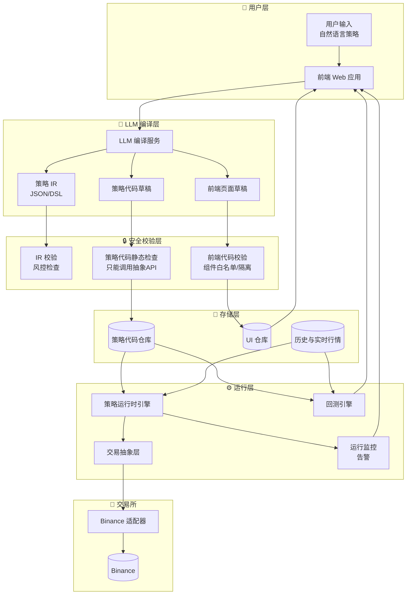
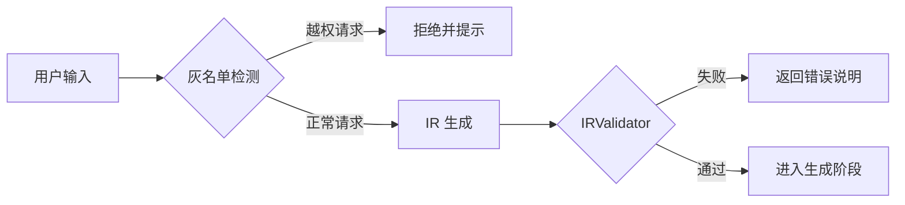
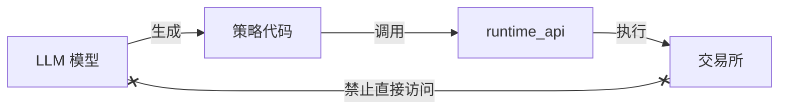
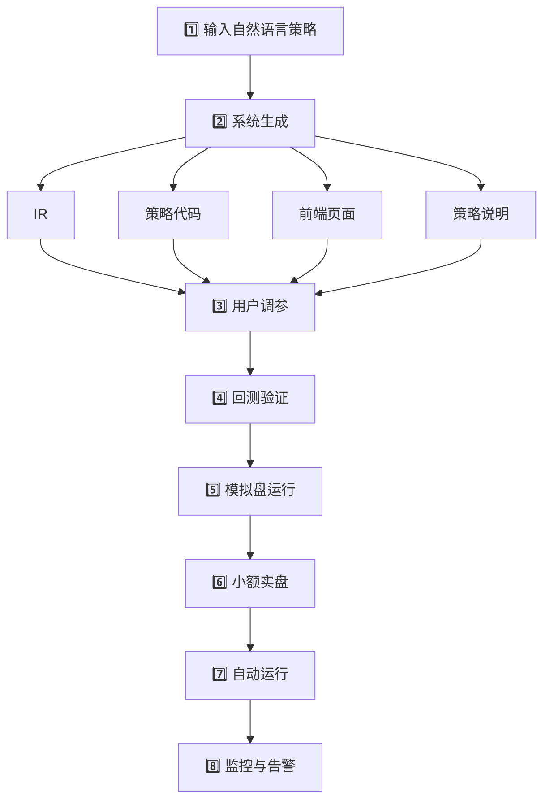

# PyQuantAlpha 系统架构设计

> **AI 驱动的量化交易策略生成与执行平台**

用户通过自然语言创建交易策略，系统自动生成策略代码、前端页面，并支持参数调节、回测与自动交易。

---

## 📋 开发状态概览

> **更新于 Phase 3 完成后 (2025-12-27)**
>
> 本文档是**产品愿景规划文档**，描述系统的完整目标蓝图。
> 实际代码结构请参考 [ARCHITECTURE_DIAGRAM.md](./ARCHITECTURE_DIAGRAM.md)。

| 模块 | 状态 | 说明 |
|------|------|------|
| **AI 策略生成** | ✅ 已实现 | LLM 接入、Prompt 模板、代码校验 |
| **策略代码生成** | ✅ 已实现 | 直接生成 Python 策略，无 IR 中间层 |
| **回测引擎** | ✅ 已实现 | 事件驱动、多资产、Sizer/Slippage/Commission |
| **技术指标库** | ✅ 已实现 | SMA/EMA/RSI/MACD/ATR/BB/ADX/Ichimoku 等 |
| **数据持久化** | ✅ 已实现 | SQLite + SQLAlchemy，透明同步 |
| **业绩分析器** | ✅ 已实现 | Sharpe/Sortino/MaxDrawdown/Returns |
| **前端基础** | ✅ 已实现 | 策略输入、回测展示、TradingView 图表 |
| IR 中间表示 | 🔲 规划中 | 结构化策略描述层 |
| 前端页面自动生成 | 🔲 规划中 | 动态 UI 组件生成 |
| 模拟盘运行 | 🔲 规划中 | 真实行情虚拟撮合 |
| 实盘交易 | 🔲 规划中 | 小额实盘 → 正常实盘 |
| 实时风控监控 | 🔲 规划中 | 熔断告警机制 |

---

## 1. 系统目标与定位

### 1.1 核心能力

| 功能模块 | 描述 |
|---------|------|
| 策略解析 | 自然语言 → 中间表示 (IR) |
| 代码生成 | IR → Python 策略代码 |
| UI 生成 | 自动生成可调参数表单 + 自定义 UI |
| 回测引擎 | 历史行情验证 + 风险分析 |
| 实盘运行 | 模拟盘 → 小额实盘 → 正常实盘 |
| 风控监控 | 实时风险检测与告警 |

### 1.2 核心理念

> **AI 是策略编译器，系统是运行时环境。**

- 用户无需编程即可创建专业策略
- LLM 仅负责生成，不直接执行交易
- 所有交易通过安全的运行时 API 执行

---

## 2. 系统架构



> **注**: 历史行情供 Backtest 使用，实时行情同时输入 Runtime 作为 `on_bar`/`on_tick` 触发源。

---

## 3. 用户工作流程

### 3.1 策略输入

用户以自然语言描述策略：

```text
用 BTCUSDT 1h K线，
当 EMA20 上穿 EMA60 时做多 30% 仓位，
价格跌破 EMA20 时平仓，
最大仓位 50%，止损 2%。
```

> [!TIP]
> **容错输入支持**：用户可提供截图、图表或零散信息，LLM 会从多模态/碎片化线索中提取策略要素。

### 3.2 生成 IR（中间表示）

LLM 将自然语言转换为结构化 IR：

```json
{
  "symbol": "BTCUSDT",
  "timeframe": "1h",

  "indicators": [
    { "name": "EMA", "period": 20, "alias": "ema20" },
    { "name": "EMA", "period": 60, "alias": "ema60" }
  ],

  "params": {
    "ema_short": { "default": 20, "min": 5, "max": 100 },
    "ema_long": { "default": 60, "min": 10, "max": 200 },
    "max_position": { "default": 0.5, "min": 0.1, "max": 1.0 },
    "stop_loss": { "default": 0.02, "min": 0.005, "max": 0.1 }
  },

  "entry_rules": [
    { "side": "long", "condition": "cross_over(ema20, ema60)", "size": 0.3 }
  ],

  "exit_rules": [
    { "condition": "price < ema20", "action": "close_all" }
  ],

  "risk": {
    "max_position": 0.5,
    "stop_loss": 0.02
  }
}
```

### 3.3 IR Schema 定义

| 字段 | 描述 |
|------|------|
| `symbol` / `timeframe` | 交易标的与周期 |
| `indicators[]` | 指标名称、参数、别名 |
| `params` | 可调参数（默认值、上下限），用于回测/实盘与前端表单 |
| `entry_rules[]` / `exit_rules[]` | 条件表达式、方向、仓位/动作 |
| `risk` | `max_position`、`stop_loss`、`max_leverage` 等硬性约束 |
| `meta` | (可选) 描述、标签、合规备注 |

> [!IMPORTANT]
> 所有数值均为小数比例，如 `0.02` = 2%。UI 参数表单直接由 `params` 生成，无需另起配置。

---

## 4. IR 校验与风控

### 4.1 静态检查项

| 检查项 | 说明 |
|--------|------|
| ✅ 必须有止损 | 禁止无保护策略 |
| ✅ 最大仓位合法 | 不超过账户限制 |
| ✅ 杠杆限制 | 符合交易所规则 |
| ❌ 禁止无止损马丁 | Martingale: 亏损后加倍加仓 |
| ✅ 参数区间合法 | 值在 min/max 范围内 |
| ✅ 指标存在性 | 引用的指标必须已实现 |

### 4.2 安全机制



> [!CAUTION]
> 越权请求将被拒绝：如"忽略限制"、"全仓 20 倍杠杆"、无止损加仓等。

- **IRValidator**: 仅做静态风控/合规检查
- **RiskEngine**: 动态风控（实盘熔断、风控事件）在 Runtime 执行

---

## 5. 策略代码生成

从 IR 模板生成 Python 策略代码：

```python
from runtime_api import order, close_all, indicator

class Strategy:
    params = {
        "ema_short": 20,
        "ema_long": 60,
        "max_position": 0.5,
        "stop_loss": 0.02
    }

    def init(self):
        self.ema20 = indicator.EMA(self.params["ema_short"])
        self.ema60 = indicator.EMA(self.params["ema_long"])
        self.last_entry_price = None

    def on_bar(self, bar):
        self.ema20.update(bar.close)
        self.ema60.update(bar.close)

        # 入场逻辑
        if not self.position and self.ema20.cross_over(self.ema60):
            if self.position_size < self.params["max_position"]:
                size = self.equity * 0.3 / bar.close
                order("BTCUSDT", "BUY", size)
                self.last_entry_price = bar.close

        # 出场逻辑
        if self.position and self.last_entry_price:
            # 止损
            if bar.close <= self.last_entry_price * (1 - self.params["stop_loss"]):
                close_all("BTCUSDT")
            # EMA 跌破
            elif bar.close < self.ema20.value:
                close_all("BTCUSDT")
```

### 5.1 运行时上下文

| 属性/方法 | 描述 |
|-----------|------|
| `self.position` | 当前持仓状态 |
| `self.position_size` | 持仓规模 |
| `self.equity` | 账户净值 |
| `order()` | 下单接口 |
| `close_all()` | 平仓接口 |
| `indicator.*` | 指标计算器 |

> [!WARNING]
> 策略代码只能调用 `runtime_api` 白名单 API，无法直接访问交易所 SDK。

---

## 6. 前端页面生成

### 6.1 页面布局

```
┌─────────────────────────────────────┐
│         策略标题 & 描述              │
├─────────────────┬───────────────────┤
│   参数表单       │    自定义 UI 区    │
│   (系统生成)     │    (AI 生成)       │
├─────────────────┴───────────────────┤
│       回测结果 / 实盘状态             │
└─────────────────────────────────────┘
```

### 6.2 参数表单自动生成

**从 IR 中提取 `params` 字段：**

```json
{
  "ema_short": { "default": 20, "min": 5, "max": 100 },
  "ema_long": { "default": 60, "min": 10, "max": 200 },
  "max_position": { "default": 0.5, "min": 0.1, "max": 1.0 }
}
```

**自动生成 UI 配置：**

```json
[
  { "name": "ema_short", "label": "短周期 EMA", "type": "number", "default": 20 },
  { "name": "ema_long", "label": "长周期 EMA", "type": "number", "default": 60 },
  { "name": "max_position", "label": "最大仓位", "type": "number", "default": 0.5 }
]
```

渲染为 `<ParamForm />` 组件。

### 6.3 自定义 UI（AI 生成）

用户可通过自然语言扩展 UI：

```text
右侧加一个收益曲线和最近 20 笔交易表格
```

**生成代码：**

```jsx
<LineChart data={backtest.equityCurve} />
<TradeTable trades={backtest.trades.slice(0, 20)} />
```

### 6.4 UI 安全约束

| 约束 | 说明 |
|------|------|
| 组件白名单 | 只能使用预定义组件 |
| DOM 隔离 | 禁止访问 `window`/`document`/`localStorage` |
| 数据注入 | 所有数据从 `props` 传入 |
| 沙箱执行 | iframe/微前端容器隔离 |

---

## 7. 回测与实盘

### 7.1 回测引擎

**目的**：用历史行情验证策略逻辑与风险特征，为实盘做入口准入。

#### 输入配置

| 配置项 | 说明 |
|--------|------|
| 策略代码 | 含参数默认值 |
| 历史行情 | K 线/逐笔（时间戳、OHLCV） |
| 时间区间 | 回测起止时间 |
| 滑点/手续费 | 模拟真实交易成本 |
| 初始资金 | 起始账户余额 |
| 年化日数 | 现货 365 / 传统 252（可配置） |

#### 处理流程


#### 输出指标

| 指标 | 计算方式 |
|------|---------|
| **收益曲线** | 按时间排序的净值序列（含基准对比） |
| **年化收益** | `(最终净值)^(年化日数/交易日数) - 1` |
| **最大回撤** | 峰值到谷值的最大跌幅 |
| **夏普比率** | 超额收益均值 / 波动率（年化） |
| **胜率** | 盈利笔数 / 总交易笔数 |
| **交易明细** | 逐笔记录 + 风控事件日志 |

### 7.2 实盘运行

#### 阶段闸门


| 阶段 | 准入条件 |
|------|---------|
| **回测通过** | 收益/回撤/夏普/胜率达标，无风控违规 |
| **模拟盘** | 真实行情虚拟撮合，验证延迟与信号稳定性 |
| **小额实盘** | 限额限频，验证委托成交率和滑点 |
| **正常实盘** | 放开额度，持续风控监控 |

#### 风控保护

| 层级 | 措施 |
|------|------|
| **账户侧** | 最大仓位、杠杆上限、单笔/日累计限制 |
| **策略侧** | 强制止损、禁止马丁、风控事件自动平仓 |
| **频率控制** | 最小下单间隔、同向连发限制、防抖 |
| **审计告警** | 每笔记录、异常推送（短信/IM/邮件） |

---

## 8. 安全与风控原则

### 8.1 模型与交易隔离



- ✅ LLM 仅生成代码，不直接交易
- ✅ 所有下单通过 `runtime_api`
- ✅ 策略代码只能调用白名单 API

### 8.2 强制风险限制

| 限制 | 说明 |
|------|------|
| 🛑 强制止损 | 所有策略必须设置止损 |
| 📊 最大仓位 | 不超过账户设定比例 |
| ⚡ 最大杠杆 | 符合交易所与用户设定 |
| 🚫 禁止马丁 | 亏损后递增加仓被禁止 |
| 🕐 订单速率 | 防止过度交易 |

### 8.3 沙箱与审核

- 策略与 UI 页面需要**预览**
- 通过审核后才向用户**上线**
- AST 静态检查 + 沙箱隔离执行

---

## 9. 用户交互流程



---

## 附录：阶段 1 限制

| 项目 | 当前支持 |
|------|---------|
| 交易所 | 仅 Binance |
| 资产类型 | 加密货币 |
| 行情 | K 线（Tick 后续支持） |
