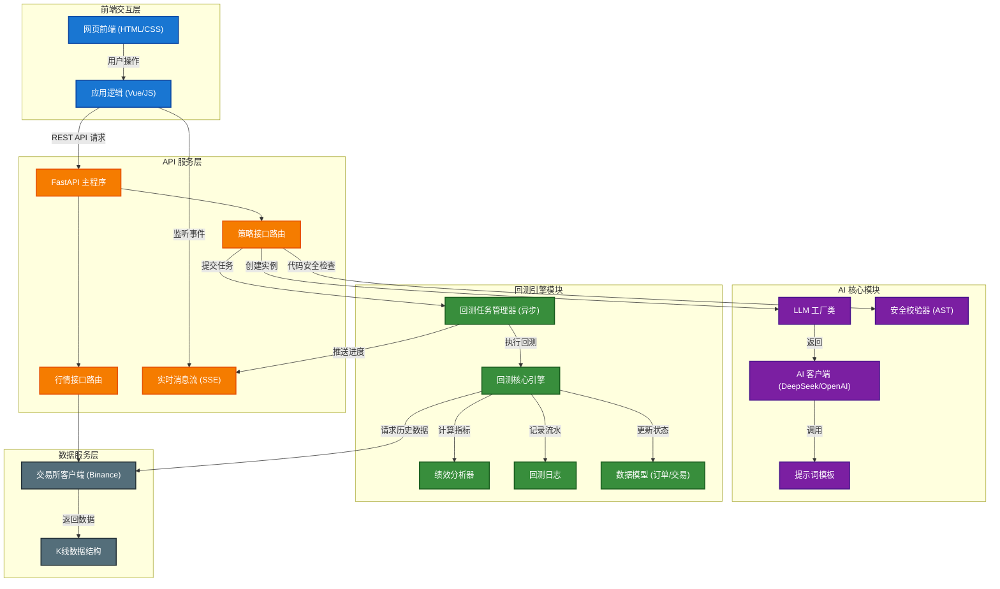
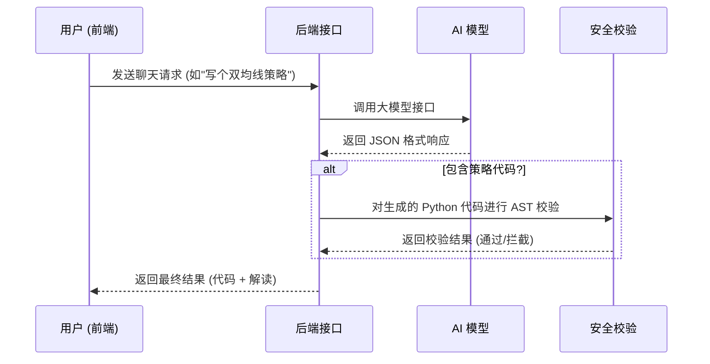
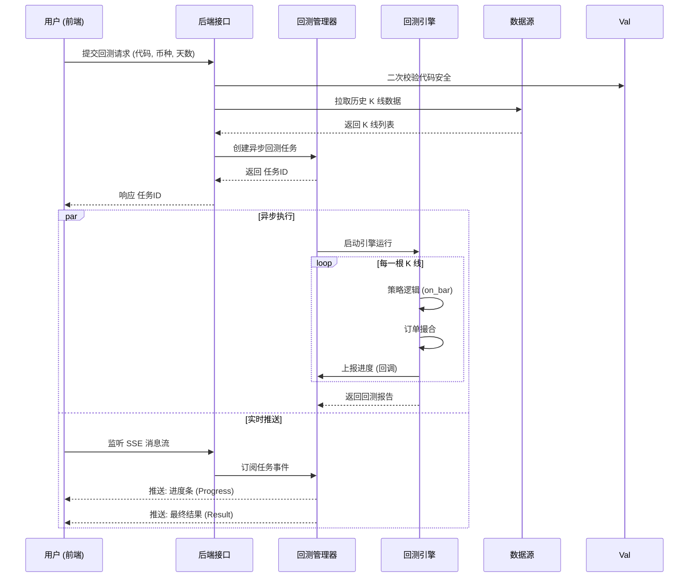

# PyQuantAlpha 系统架构图

## 顶层架构概览

PyQuantAlpha 是一个基于 FastAPI 的 AI 驱动量化回测平台。核心架构分为 **前端交互层**、**API 服务层**、**AI 核心层**、**回测引擎层** 和 **数据服务层**。

---

## 核心业务流程

### 1. 策略生成流程 (AI Strategy Generation)

### 2. 回测执行流程 (Backtest Execution)

---

## 模块职责说明

### `src.ai` (AI 核心)
负责与大模型交互，智能生成和解释量化策略。
- **工厂类 (Factory)**: 负责创建不同的大模型客户端（如 DeepSeek, OpenAI）。
- **校验器 (Validator)**: 基于 AST (抽象语法树) 的静态代码分析工具，防止生成的代码包含删除文件等危险操作。
- **响应结构**: 统一封装 AI 返回的数据格式。

### `src.backtest` (回测系统)
执行量化策略的核心模块。
- **管理器 (Manager)**: 异步任务调度中心，负责管理并发的回测任务和消息推送。
- **核心引擎 (Engine)**: 纯 Python 实现的事件驱动回测引擎，模拟交易所撮合逻辑。
- **日志 (Logger)**: 记录详细的交易流水，用于前端图表展示。

### `src.data` (数据服务)
负责市场数据的获取与清洗。
- **客户端 (BinanceClient)**: 封装交易所 API，支持自动分页拉取长周期数据。

### `src.api` (接口层)
对外提供 HTTP 服务。
- **FastAPI**: 高性能 Web 框架，提供 RESTful 接口和 SSE 实时流功能。
