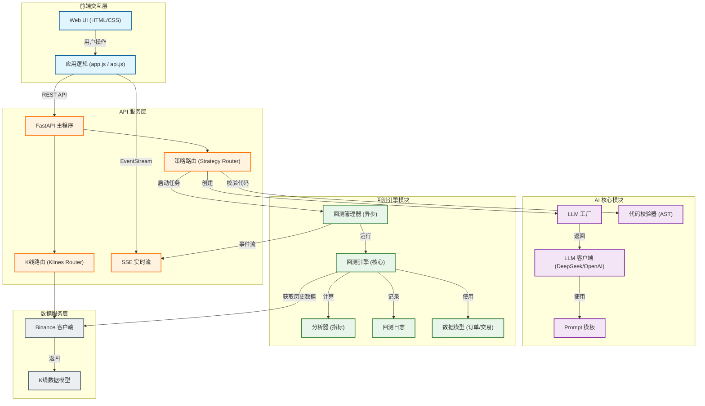
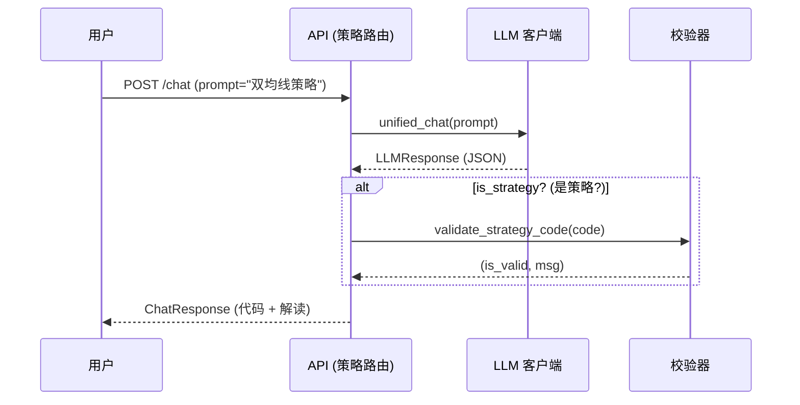
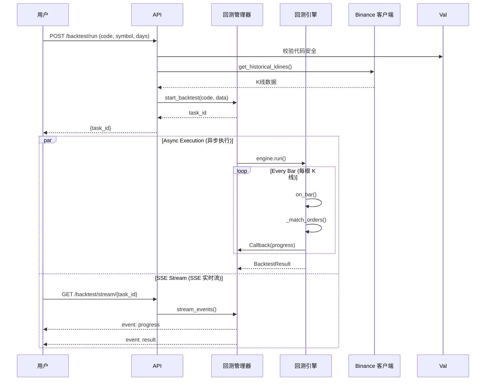

# PyQuantAlpha 系统架构图

## 顶层架构概览 (System Overview)

PyQuantAlpha 是一个基于 FastAPI 的 AI 驱动量化回测平台。核心架构分为 **前端交互层**、**API 服务层**、**AI 核心层**、**回测引擎层** 和 **数据服务层**。

---

## 核心交互流程 (Sequence Flows)

### 1. 策略生成流程 (AI Strategy Generation)

### 2. 回测执行流程 (Backtest Execution)

---

## 模块职责说明

### `src.ai`
负责与大模型交互，生成和解释策略代码。
- **Factory**: 工厂模式创建 LLM 客户端。
- **Validator**: 基于 AST 的静态代码分析，防止恶意代码注入。
- **Response**: 统一的 `LLMResponse` 数据结构。

### `src.backtest`
核心回测逻辑。
- **Manager**: 异步任务管理器，处理多任务并发和 SSE 消息推送。
- **Engine**: 纯 Python 实现的事件驱动回测引擎。
- **Logger**: 结构化日志记录器。

### `src.data`
数据获取与适配。
- **BinanceClient**: 封装 Binance REST API，支持链式调用和自动分页。

### `src.api`
对外 HTTP 接口。
- **FastAPI**: 提供 RESTful 接口和 SSE 流。
