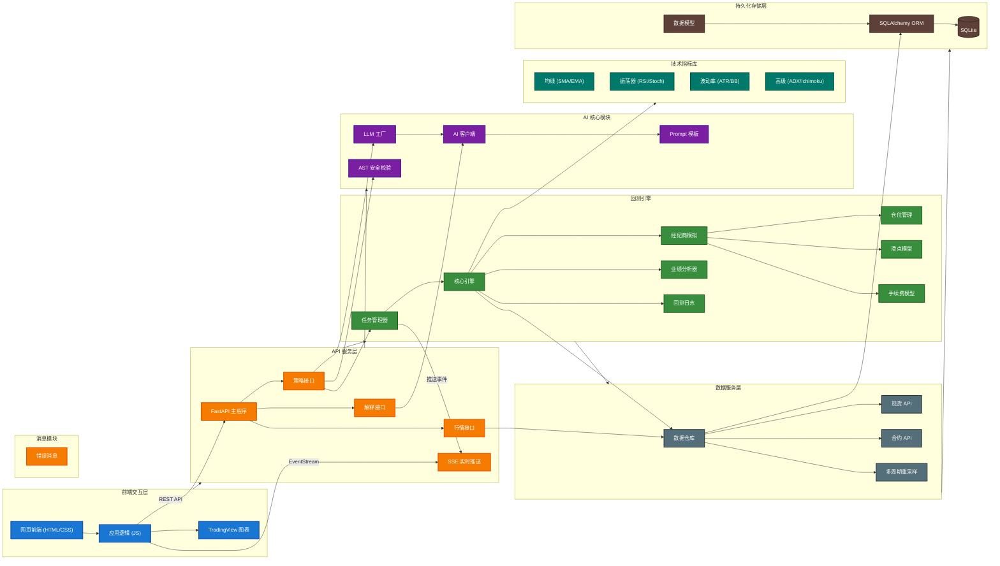
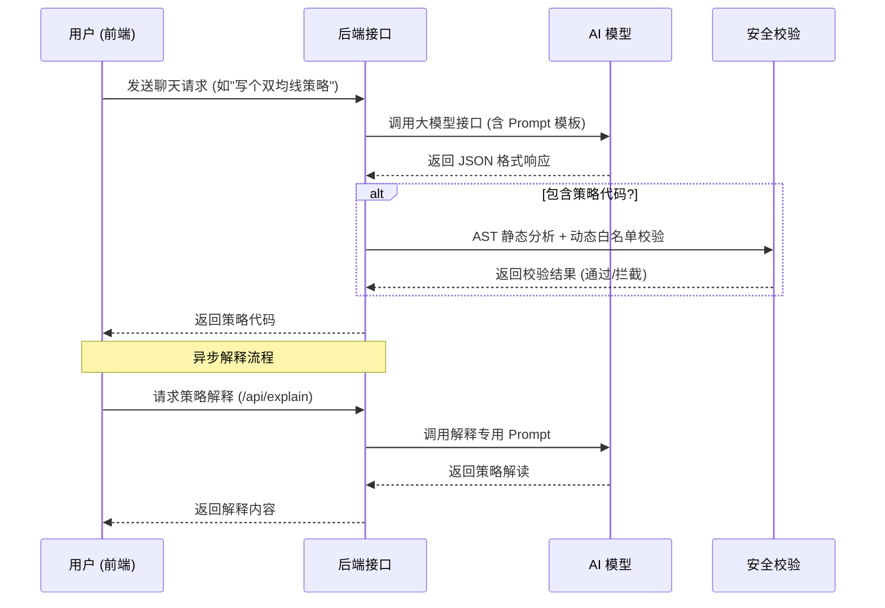
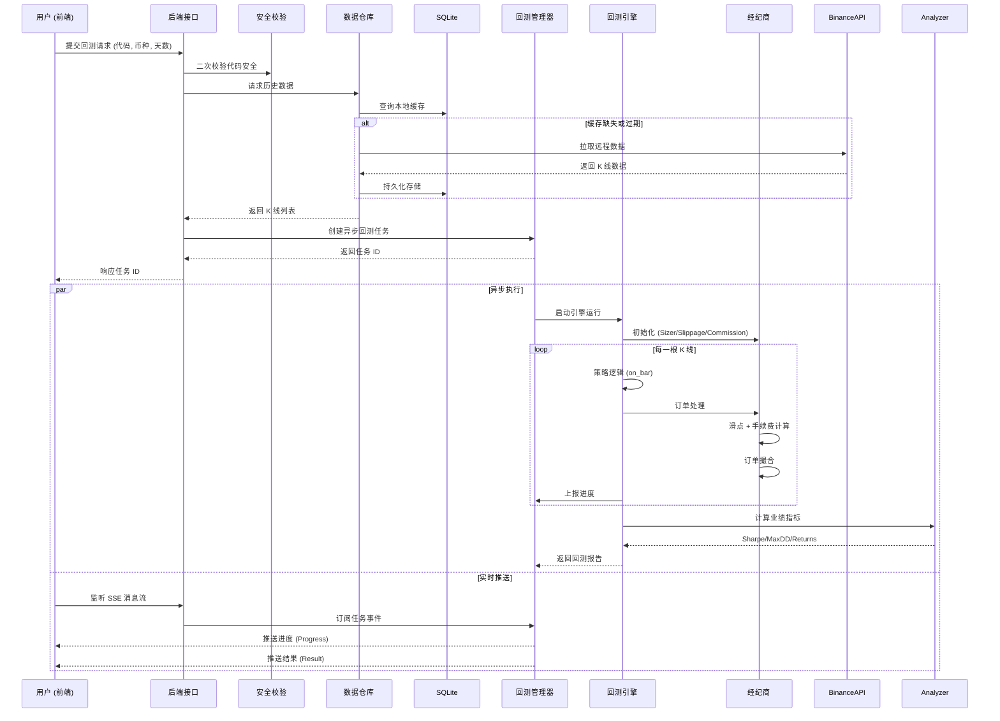
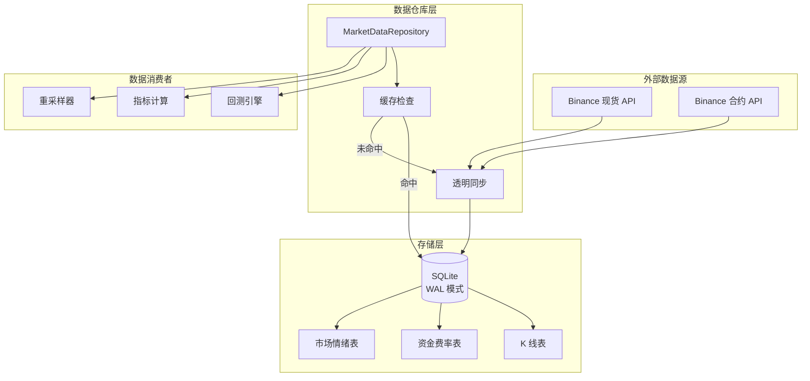
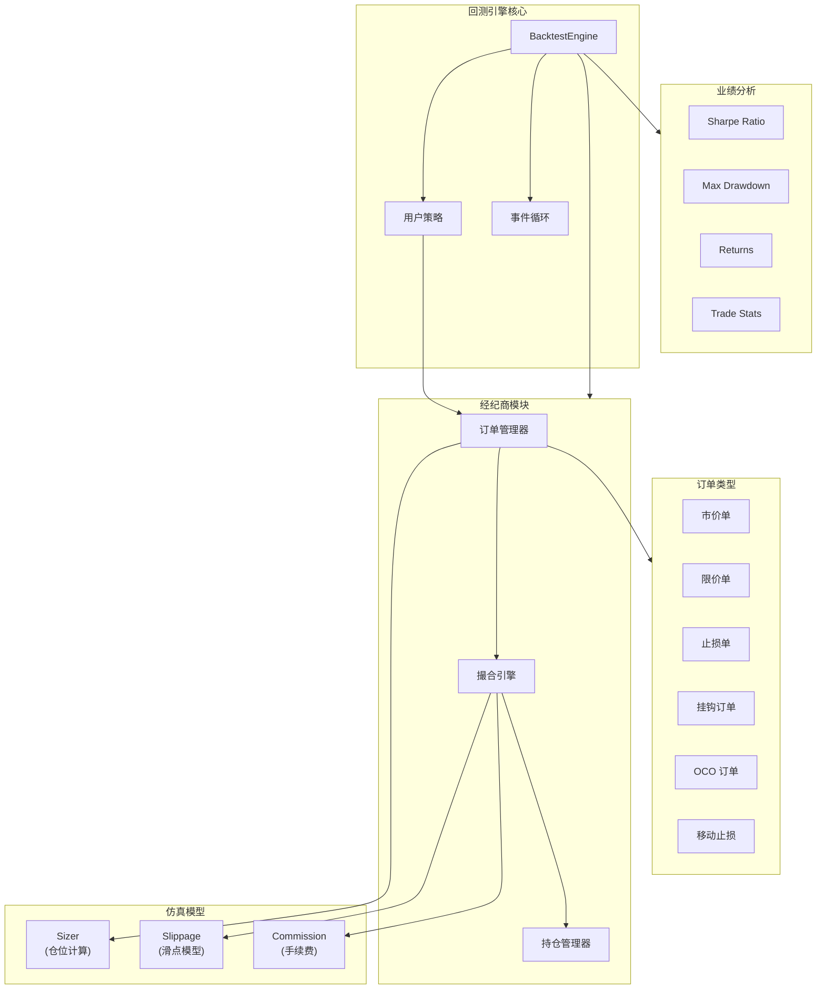

# PyQuantAlpha 系统架构图

> **更新于 Phase 3 完成后 (2025-12-27)**

## 顶层架构概览

PyQuantAlpha 是一个基于 FastAPI 的 AI 驱动量化回测平台。核心架构分为 **前端交互层**、**API 服务层**、**AI 核心层**、**回测引擎层**、**数据服务层** 和 **存储层**。

---

## 核心业务流程

### 1. 策略生成流程 (AI Strategy Generation)

### 2. 回测执行流程 (Backtest Execution)

---

## 模块职责说明

### `src.ai` (AI 核心)

负责与大模型交互，智能生成和解释量化策略。

| 组件 | 文件 | 职责 |
|------|------|------|
| 工厂类 | `factory.py` | 创建不同的 LLM 客户端实例 |
| 基类 | `base.py` | 定义 LLM 客户端抽象接口 |
| DeepSeek | `deepseek.py` | DeepSeek API 实现 |
| OpenAI | `openai_client.py` | OpenAI API 实现 |
| Prompt | `prompt.py` | 策略生成/解释的系统提示词模板 |
| 校验器 | `validator.py` (via backtest) | AST 静态分析 + 动态白名单 |

---

### `src.backtest` (回测系统)

执行量化策略的核心模块，包含完整的交易仿真系统。

| 组件 | 文件/目录 | 职责 |
|------|-----------|------|
| 管理器 | `manager.py` | 异步任务调度，管理并发回测 |
| 核心引擎 | `engine.py` | 事件驱动回测，协调各模块 |
| 经纪商 | `broker.py` | 订单撮合、持仓管理、高级订单 (Bracket/OCO/TrailingStop) |
| 仓位管理 | `sizers/` | FixedSize / PercentSize / AllIn / RiskSize |
| 滑点模型 | `slippage/` | 固定滑点 / 百分比滑点 |
| 手续费 | `commission.py` | 手续费计算模型 |
| 分析器 | `analyzers/` | Sharpe / Sortino / MaxDrawdown / Returns / Trades |
| 数据 Feed | `feed.py` | 多时间周期数据对齐 |
| 加载器 | `loader.py` | 策略代码安全加载 |
| 日志 | `logger.py` | 交易流水记录 |
| 模型 | `models.py` | Order / Position / Bar 等数据结构 |

---

### `src.data` (数据服务)

负责市场数据的获取、缓存与清洗。

| 组件 | 文件 | 职责 |
|------|------|------|
| 数据仓库 | `repository.py` | 透明同步层，统一数据访问入口 |
| 现货客户端 | `binance.py` | Binance 现货 API 封装 |
| 合约客户端 | `binance_futures.py` | Binance Futures API (资金费率/多空比) |
| 重采样器 | `resampler.py` | K 线多周期重采样 |
| 数据模型 | `models.py` | Bar / Tick 等数据结构 |
| 抽象基类 | `base.py` | 数据源抽象接口 |

---

### `src.database` (持久化存储)

基于 SQLAlchemy 的本地数据持久化层。

| 组件 | 文件 | 职责 |
|------|------|------|
| 数据库管理 | `database.py` | SQLite 连接池、WAL 模式配置 |
| ORM 模型 | `models.py` | Candlestick / FundingRate / MarketSentiment |

---

### `src.indicators` (技术指标)

完整的技术分析指标库。

| 组件 | 文件 | 包含指标 |
|------|------|----------|
| 基类 | `base.py` | BaseIndicator 抽象类 |
| 均线类 | `ma.py` | SMA, EMA |
| 振荡器 | `oscillator.py` | RSI, Stochastic, CCI, Williams %R |
| 波动率 | `volatility.py` | ATR, Bollinger Bands |
| 高级指标 | `advanced.py` | MACD, ADX, Ichimoku, OBV |

---

### `src.messages` (消息模块)

统一的消息管理系统。

| 组件 | 文件 | 职责 |
|------|------|------|
| 错误消息 | `errorMessage.py` | 多交易所错误码映射、链式消息构建 |

---

### `src.api` (接口层)

对外提供 HTTP 服务。

| 组件 | 文件/目录 | 职责 |
|------|-----------|------|
| 主程序 | `main.py` | FastAPI 应用入口 |
| 路由 | `routes/` | 策略 / 行情 / 解释 / SSE 接口 |
| 静态资源 | `static/` | 前端 HTML/CSS/JS |
| 数据模式 | `schemas/` | Pydantic 请求/响应模型 |

---

## 数据流架构

---

## 回测引擎内部架构

---

## 版本演进

| 阶段 | 主要特性 |
|------|----------|
| Phase 1 | AI 策略生成、基础回测引擎、安全校验 |
| Phase 2 | 多资产回测、高级订单、增强日志、SSE 实时推送 |
| Phase 3 | 数据持久化、衍生品数据、Sizer/Slippage/Commission、分析器集成 |
