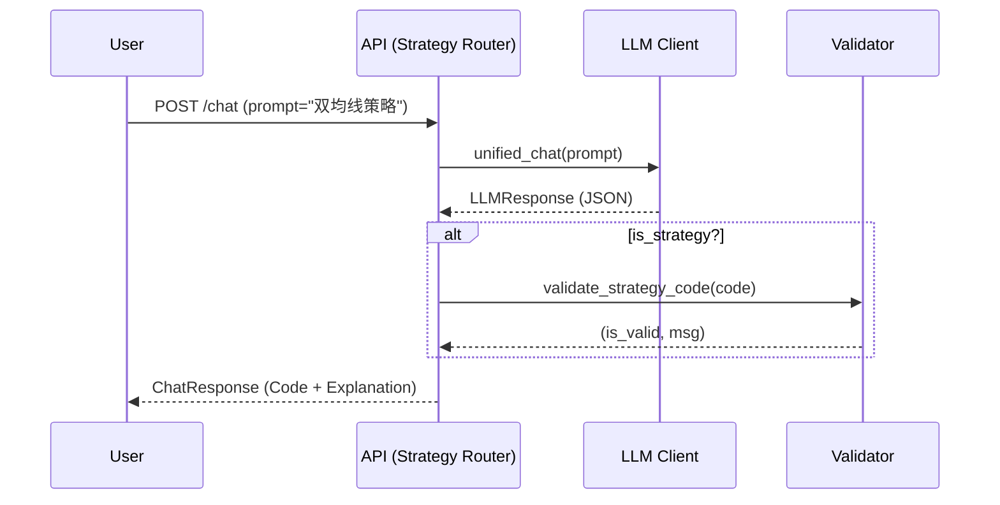
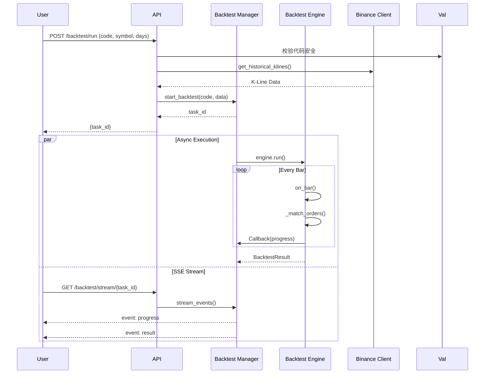

# PyQuantAlpha 系统架构图

## 顶层架构概览 (System Overview)

PyQuantAlpha 是一个基于 FastAPI 的 AI 驱动量化回测平台。核心架构分为 **前端交互层**、**API 服务层**、**AI 核心层**、**回测引擎层** 和 **数据服务层**。

```mermaid
graph TD
    %% 样式定义
    classDef front fill:#e1f5fe,stroke:#01579b,stroke-width:2px;
    classDef api fill:#fff3e0,stroke:#ff6f00,stroke-width:2px;
    classDef ai fill:#f3e5f5,stroke:#7b1fa2,stroke-width:2px;
    classDef backtest fill:#e8f5e9,stroke:#2e7d32,stroke-width:2px;
    classDef data fill:#eceff1,stroke:#455a64,stroke-width:2px;

    %% 前端层
    subgraph Frontend [前端交互层]
        UI[Web UI (HTML/CSS)]:::front
        JS[App logic (app.js / api.js)]:::front
    end

    %% API 层
    subgraph API [API 服务层]
        FastAPI[FastAPI Main]:::api
        Route_Strat[Strategy Router]:::api
        Route_Klines[Klines Router]:::api
        SSE[SSE Stream]:::api
    end

    %% AI 核心
    subgraph AICore [AI 核心模块]
        Factory[LLM Factory]:::ai
        Client[LLM Client (DeepSeek/OpenAI)]:::ai
        Prompt[Prompt Template]:::ai
        Validator[Code Validator (AST)]:::ai
    end

    %% 回测引擎
    subgraph Backtest [回测引擎模块]
        Manager[Backtest Manager (Async)]:::backtest
        Engine[Backtest Engine (Core)]:::backtest
        Analyzer[Analyzer (Metrics)]:::backtest
        Logger[Backtest Logger]:::backtest
        Models[Data Models (Order/Trade)]:::backtest
    end

    %% 数据层
    subgraph Data [数据服务层]
        Binance[Binance Client]:::data
        Bar[Bar Data Model]:::data
    end

    %% 关系流向
    UI -->|User Action| JS
    JS -->|REST API| FastAPI
    JS -->|EventStream| SSE

    FastAPI --> Route_Strat
    FastAPI --> Route_Klines

    %% 策略生成流
    Route_Strat -->|Create| Factory
    Factory -->|Return| Client
    Client -->|Use| Prompt
    Route_Strat -->|Validate Code| Validator

    %% 回测流
    Route_Strat -->|Start Task| Manager
    Manager -->|Stream Events| SSE
    Manager -->|Run| Engine
    Engine -->|Record| Logger
    Engine -->|Calculate| Analyzer
    Engine -->|Uses| Models

    %% 数据流
    Route_Klines --> Binance
    Engine -->|Fetch History| Binance
    Binance -->|Return| Bar
```

---

## 核心交互流程 (Sequence Flows)

### 1. 策略生成流程 (AI Strategy Generation)



### 2. 回测执行流程 (Backtest Execution)



---

## 模块职责说明

### `src.ai`
负责与大模型交互，生成和解释策略代码。
- **Factory**: 工厂模式创建 LLM 客户端。
- **Validator**: 基于 AST 的静态代码分析，防止恶意代码注入。
- **Response**: 统一的 `LLMResponse` 数据结构。

### `src.backtest`
核心回测逻辑。
- **Manager**: 异步任务管理器，处理多任务并发和 SSE 消息推送。
- **Engine**: 纯 Python 实现的事件驱动回测引擎。
- **Logger**: 结构化日志记录器。

### `src.data`
数据获取与适配。
- **BinanceClient**: 封装 Binance REST API，支持链式调用和自动分页。

### `src.api`
对外 HTTP 接口。
- **FastAPI**: 提供 RESTful 接口和 SSE 流。
