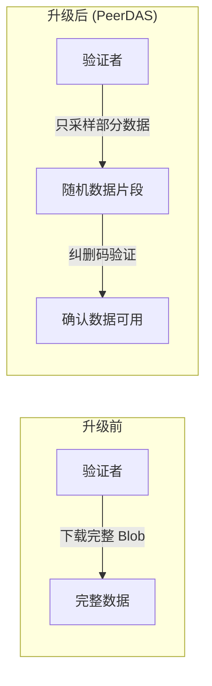
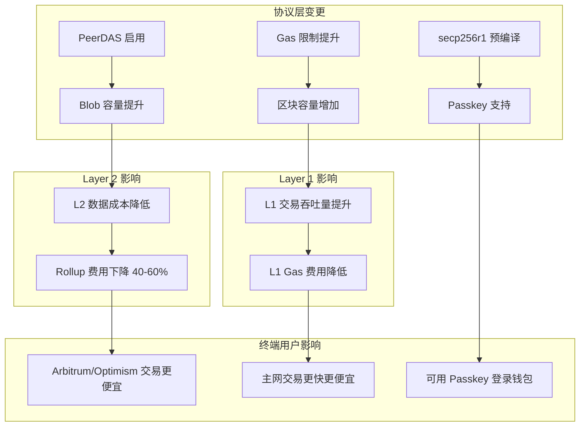

# 以太坊 Fusaka 升级技术报告

> **升级日期**: 2025年12月3日  
> **升级类型**: 硬分叉（Hard Fork）  
> **代号**: Fusaka = Fulu（共识层）+ Osaka（执行层）

---

## 1. 升级概述

Fusaka 是以太坊在 2025 年的第二次重大升级，继 2025 年 5 月的 Pectra 升级之后。这是自 2022 年"合并"(The Merge) 以来最重要的扩容升级之一。

### 1.1 核心目标

| 目标 | 描述 |
|------|------|
| **提升 L2 扩容能力** | 当前峰值 2.5x，远期目标 12x |
| **降低 L2 费用** | Layer 2 交易费用降低 40-60% |
| **提高 L1 吞吐量** | Gas 限制从 3600 万提升至 6000 万 |
| **减少节点负载** | 验证者带宽需求降低 80-85% |

### 1.2 里程碑时间线

```
2024年3月    Dencun 升级（引入 Blob，目标 3，最大 6）
     ↓
2025年5月    Pectra 升级（账户抽象，Blob 目标提升至 6）
     ↓
2025年12月3日 Fusaka 升级（PeerDAS 上线）← 当前
     ↓
2025年12月9日 BPO 升级（Blob 最大值提升至 15）
     ↓
2026年1月7日  BPO 升级（计划：目标 14，最大 21）
     ↓
2026年+      继续扩容至目标 48，最大 72
```

---

## 2. 核心技术：PeerDAS

### 2.1 什么是 PeerDAS？

**PeerDAS**（Peer Data Availability Sampling，对等数据可用性采样）是 Fusaka 升级的核心技术，定义在 **EIP-7594** 中。



### 2.2 技术原理

| 概念 | 说明 |
|------|------|
| **数据分片** | Blob 数据被分割成 128 个子网（columns） |
| **纠删码** | 使用 Reed-Solomon 编码，只需 50% 数据即可重建完整数据 |
| **随机采样** | 每个验证者只需下载和验证随机分配的数据片段 |
| **概率验证** | 通过采样足够多的片段，统计上保证数据可用性 |

### 2.3 Blob 参数变化（渐进式扩容）

| 阶段 | 时间 | 目标值 | 最大值 | 说明 |
|------|------|--------|--------|------|
| Dencun | 2024.3 | 3 | 6 | 引入 Blob |
| Pectra | 2025.5 | 6 | 6 | 提升目标值 |
| Fusaka | 2025.12.3 | 6 | 9 | PeerDAS 上线 |
| **BPO #1** | **2025.12.9** | **6** | **15** | **当前状态** |
| BPO #2 | 2026.1.7 | 14 | 21 | 计划中 |
| 远期目标 | 2026+ | 48 | 72 | PeerDAS 完全发挥 |

> **注意**：虽然 PeerDAS 理论上支持 48-72 个 Blob，但采用渐进式扩容策略，确保网络稳定。

### 2.4 性能提升（当前 vs 未来）

| 指标 | Dencun 后 | 当前 (BPO #1) | 远期目标 |
|------|-----------|---------------|----------|
| Blob 最大值 | 6 | **15** | 72 |
| 验证者带宽 | 100% | ~50% | 15-20% |
| L2 费用 | 基准 | 降低 30-40% | 降低 60%+ |

### 2.5 L2 TPS 计算

**计算公式**：
```
L2 TPS = (Blob 数 × 128 KB) / 每笔交易字节数(~15B) / 出块时间(12s)
```

**按目标值计算（常态 TPS）**：

| 阶段 | 目标值 | L2 常态 TPS | 提升 |
|------|--------|-------------|------|
| Pectra 后 | 6 | 4,369 | 基准 |
| 当前 (BPO #1) | 6 | 4,369 | **0%** |
| BPO #2 计划 | 14 | 10,194 | 2.3x |
| 远期目标 | 48 | 34,952 | 8x |

**按最大值计算（峰值 TPS）**：

| 阶段 | 最大值 | L2 峰值 TPS | 提升 |
|------|--------|-------------|------|
| Pectra 后 | 6 | 4,369 | 基准 |
| **当前 (BPO #1)** | **15** | **10,922** | **2.5x** |
| BPO #2 计划 | 21 | 15,291 | 3.5x |
| 远期目标 | 72 | 52,428 | 12x |

> **当前状态**：常态 TPS 不变（目标值仍为 6），峰值 TPS 提升 2.5 倍。

---

## 3. 完整 EIP 清单

### 3.1 扩容相关

| EIP | 名称 | 描述 |
|-----|------|------|
| **EIP-7594** | PeerDAS | 对等数据可用性采样，核心扩容技术 |
| **EIP-7892** | BPO Hardforks | 允许仅调整 Blob 参数的轻量级分叉（见下文） |
| **EIP-7918** | Blob base-fee floor | 将 Blob 费用与执行 Gas 挂钩，防止费用过低 |
| **EIP-7935** | Default block gas limit increase | 将区块 Gas 限制提升至 6000 万 |

### 3.2 什么是 BPO（EIP-7892）？

**BPO = Blob-Parameter-Only**，一种轻量级分叉机制，只调整 Blob 相关参数。

| 对比 | 传统硬分叉 | BPO 升级 |
|------|-----------|----------|
| 范围 | 多个协议变更 | 仅 Blob 参数 |
| 准备时间 | 数月 | 数天~数周 |
| 风险 | 较高 | 很低 |
| 用途 | 重大功能升级 | 逐步提升 Blob 容量 |

**已执行的 BPO 升级**：
- 2025.12.9：最大值 9 → 15（目标值不变）

**计划的 BPO 升级**：
- 2026.1.7：目标值 6 → 14，最大值 15 → 21

### 3.2 网络优化

| EIP | 名称 | 描述 |
|-----|------|------|
| **EIP-7642** | eth/69 networking update | 更新执行层 P2P 协议，减少带宽使用 |
| **EIP-7917** | Deterministic proposer lookahead | 预计算未来 epoch 的提议者列表 |
| **EIP-7825** | Per-transaction gas cap | 单笔交易 Gas 上限 16,777,216 |
| **EIP-7934** | RLP Execution Block Size Limit | 区块数据大小硬上限 10 MiB |

### 3.3 安全与功能

| EIP | 名称 | 描述 |
|-----|------|------|
| **EIP-7951** | secp256r1 Precompile | 支持 Passkey 签名验证 |
| **EIP-7883** | ModExp Gas Cost Increase | 提高 ModExp 预编译的 Gas 成本 |
| **EIP-7823** | Set upper bounds for MODEXP | 设置 MODEXP 操作上限 |
| **EIP-7939** | CLZ opcode | 新增"计算前导零"EVM 操作码 |

---

## 4. 对用户的影响链路

### 4.1 影响链路图



### 4.2 对不同用户群体的影响

#### 普通用户

| 影响 | 说明 | 用户操作 |
|------|------|---------|
| ✅ L2 费用降低 | Arbitrum、Optimism 等交易费下降 40-60% | 无需操作，自动生效 |
| ✅ L1 费用降低 | 主网交易 Gas 费用降低 | 无需操作，自动生效 |
| ✅ Passkey 登录 | 可使用指纹/Face ID 登录 DApp | 等待钱包支持 |
| ⚠️ 无资产风险 | 升级不影响资产安全 | 无需转移资产 |

#### DeFi 用户

| 影响 | 说明 |
|------|------|
| ✅ 套利成本降低 | L2 交易费降低使小额套利更可行 |
| ✅ LP 收益提升 | 更低的 Gas 费用意味着更多净收益 |
| ✅ 跨链桥更便宜 | L2 之间的桥接成本降低 |

#### NFT 用户

| 影响 | 说明 |
|------|------|
| ✅ Mint 成本降低 | 在 L2 上 Mint NFT 更便宜 |
| ✅ 交易费降低 | NFT 买卖的 Gas 费用降低 |

#### 开发者

| 影响 | 说明 |
|------|------|
| ✅ 部署成本降低 | 在 L2 部署合约更便宜 |
| ✅ Passkey 集成 | 可为用户提供无密钥登录体验 |
| ✅ 新操作码 | CLZ 操作码可优化某些算法 |
| ⚠️ Gas 估算调整 | 可能需要重新测试 Gas 估算逻辑 |

#### 验证者/节点运营者

| 影响 | 说明 | 操作 |
|------|------|------|
| ⚠️ 客户端升级 | 必须升级到支持 Fusaka 的客户端版本 | **必须在升级前完成** |
| ✅ 带宽需求降低 | PeerDAS 减少 80% 带宽需求 | 可能降低运营成本 |
| ⚠️ 存储调整 | Blob 存储方式变化 | 检查磁盘空间 |

### 4.3 用户操作指南

#### 升级前（无需操作）

```
✅ 普通用户：无需任何操作
✅ DeFi 用户：无需撤出资金
✅ NFT 用户：无需转移 NFT
```

#### 升级后（享受收益）

```
✅ 在 L2 上进行交易，享受更低费用
✅ 等待钱包支持 Passkey 登录
✅ 如使用自建节点，确认已升级客户端
```

---

## 5. 对量化交易的影响

### 5.1 积极影响

| 方面 | 影响 | 说明 |
|------|------|------|
| **套利机会** | 增加 | L2 交易成本降低，使小额套利变得可行 |
| **高频交易** | 利好 | 区块容量增加，交易确认更快 |
| **跨链套利** | 增加 | L2 之间桥接成本降低 |
| **Gas 成本** | 降低 | 策略运行成本显著降低 |

### 5.2 对本项目 (PyQuantAlpha) 的影响

| 模块 | 影响 | 建议 |
|------|------|------|
| **回测引擎** | 需更新 Gas 估算模型 | 使用 Fusaka 后的 Gas 数据 |
| **策略生成** | L2 策略更有价值 | 考虑支持 L2 数据源 |
| **费用计算** | 手续费模型需调整 | 区分 L1/L2 费用结构 |

---

## 6. 技术对比：Dencun vs Pectra vs Fusaka

| 特性 | Dencun (2024.3) | Pectra (2025.5) | Fusaka (2025.12) |
|------|-----------------|-----------------|------------------|
| **核心技术** | Blob 引入 | 账户抽象 | PeerDAS |
| **扩容倍数** | 基准 | 1.5-2x | **当前 2.5x，远期 12x** |
| **L2 费用** | 降低 90% | 降低 30% | **再降 40-60%** |
| **验证者负载** | 增加 | 不变 | **降低 80%** |
| **用户体验** | 间接改善 | 直接改善 | 间接改善 |

---

## 7. 未来展望

### 7.1 路线图位置

Fusaka 是以太坊"Surge"（扩容）阶段的关键里程碑：

```
The Merge (2022) → Dencun (2024) → Pectra (2025.5) → Fusaka (2025.12)
                                                        ↓
                                              Danksharding (2026+)
                                                        ↓
                                              完整分片 / 10万 TPS
```

### 7.2 预期里程碑

| 时间 | 里程碑 | 预期 TPS |
|------|--------|---------|
| 2025.12 | Fusaka 上线 | 10,000+ (L2) |
| 2026 | 进一步扩容 | 12,000+ (L2) |
| 2027+ | 完整 Danksharding | 100,000+ (L2) |

---

## 8. 总结

### 关键要点

1. **Fusaka 是扩容升级**：核心是 PeerDAS，当前峰值 TPS 提升 2.5 倍，远期目标 12 倍
2. **L2 费用大幅降低**：Arbitrum、Optimism 等交易费降低 40-60%
3. **普通用户无需操作**：资产安全，费用自动降低
4. **验证者必须升级**：在 2025.12.3 前升级客户端
5. **量化交易利好**：更低的交易成本，更多套利机会

### 官方资源

- [Ethereum.org - Fusaka](https://ethereum.org/en/roadmap/fusaka/)
- [EIP-7594: PeerDAS](https://eips.ethereum.org/EIPS/eip-7594)
- [以太坊路线图](https://ethereum.org/en/roadmap/)

---

*报告生成日期: 2025-12-10*
