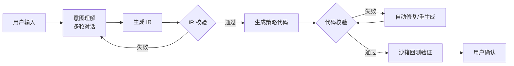

# PyQuantAlpha 可行性分析报告

> **评估日期**: 2025 年 12 月  
> **项目**: AI 驱动的量化交易策略生成与执行平台  
> **方案**: AI 直接生成策略代码（无模板库）

---

## 1. 执行摘要

| 维度 | 评分 | 结论 |
|------|------|------|
| 技术可行性 | ⭐⭐⭐⭐ 7/10 | ✅ 可行，LLM 代码生成能力已成熟 |
| 商业可行性 | ⭐⭐⭐⭐ 8/10 | ✅ 差异化优势明显，市场空白 |
| 风险控制 | ⭐⭐⭐ 5/10 | ⚠️ AI 生成代码需严格校验 |
| 实施复杂度 | ⭐⭐⭐ 6/10 | ⚠️ Prompt 工程与代码校验是核心难点 |

**核心方案**: 用户自然语言 → LLM 直接生成 IR + 策略代码，**无预定义模板库**。

**总体结论**: 技术可行，但需要更强的 AI 工程能力和代码校验机制。

---

## 2. AI 直接生成 vs 模板库对比

| 维度 | AI 直接生成 | 模板库方案 |
|------|------------|-----------|
| **灵活性** | ⭐⭐⭐⭐⭐ 任意策略 | ⭐⭐ 只能选预定义 |
| **开发复杂度** | ⭐⭐⭐ 较高 | ⭐⭐⭐⭐⭐ 较低 |
| **准确性风险** | ⭐⭐⭐ 需要校验 | ⭐⭐⭐⭐⭐ 可控 |
| **用户体验** | ⭐⭐⭐⭐⭐ 自由创作 | ⭐⭐⭐ 受限 |
| **差异化** | ⭐⭐⭐⭐⭐ 独特卖点 | ⭐⭐ 竞品都有 |

**选择 AI 直接生成的理由**:
- 真正实现"自然语言到策略"的愿景
- 产品差异化竞争力强
- GPT-4/Claude 代码生成能力已足够成熟

---

## 3. 模块可行性分析

### 3.1 核心模块评估

| 模块 | 可行性 | 关键挑战 | 解决方案 |
|------|--------|---------|---------|
| **自然语言 → IR** | ⭐⭐⭐⭐ | 意图理解准确性 | Few-shot + 多轮对话确认 |
| **IR → 策略代码** | ⭐⭐⭐⭐ | 代码正确性 | AST 校验 + 沙箱测试 |
| **代码安全校验** | ⭐⭐⭐⭐⭐ | API 白名单 | 静态分析 + 运行时隔离 |
| **回测引擎** | ⭐⭐⭐⭐⭐ | 无 | 复用 Backtrader |
| **风控规则** | ⭐⭐⭐⭐⭐ | 无 | IR 层强制校验 |

### 3.2 AI 代码生成流程

### 3.3 代码校验机制

| 校验层 | 检查项 | 实现方式 |
|--------|--------|---------|
| **语法层** | Python 语法正确 | `ast.parse()` |
| **API 层** | 只调用白名单 API | AST 遍历 + 符号表检查 |
| **逻辑层** | 必须有止损/仓位控制 | IR 规则 + 代码模式匹配 |
| **运行层** | 能正常执行 | 沙箱试运行 |

---

## 4. 技术栈建议

| 层级 | 推荐技术 |
|------|---------|
| 后端 | Python (FastAPI) |
| LLM | GPT-4 / Claude 3.5 |
| 代码校验 | Python AST + RestrictedPython |
| 回测 | Backtrader / 自研 |
| 前端 | React + 对话式 UI |
| 沙箱 | Docker / nsjail |

---

## 5. 风险与缓解

| 风险 | 概率 | 影响 | 缓解措施 |
|------|------|------|---------|
| **AI 生成错误代码** | 高 | 高 | 多层校验 + 沙箱测试 + 用户确认 |
| **AI 误解用户意图** | 高 | 中 | 多轮对话确认 + IR 预览 |
| **生成危险策略** | 中 | 高 | IR 层强制风控规则 |
| **代码绕过校验** | 低 | 高 | 白名单 API + 运行时隔离 |
| **实盘亏损纠纷** | 中 | 高 | 风险提示 + 免责 + 人工审核 |

---

## 6. 关键成功因素

1. **Prompt 工程质量** - 决定生成准确性
2. **多层代码校验** - 确保生成代码安全可靠
3. **用户确认环节** - 不能自动执行未确认的策略
4. **沙箱回测验证** - 先跑通回测再上线
5. **人工审核闸门** - 实盘前必须人工审核

---

## 7. 结论

### ✅ 方案可行

AI 直接生成策略的方案**技术可行**，且具有更强的产品差异化优势。

### ⚠️ 关键风险点

| 风险 | 应对 |
|------|------|
| AI 生成错误 | 多层校验 + 必须用户确认 |
| 意图误解 | 多轮对话 + IR 预览确认 |
| 安全漏洞 | 白名单 API + 沙箱隔离 |

### 🎯 第一步建议

1. 先完成 **Prompt 工程原型**，验证 GPT-4/Claude 生成质量
2. 搭建 **代码校验框架**，确保安全基础
3. 集成 **回测引擎**，形成完整闭环

---

*报告生成日期: 2025-12-10*
