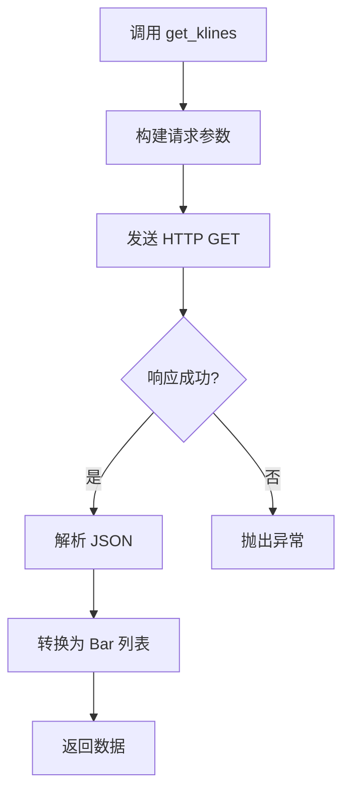

# Step 2: 数据层开发文档

> **目标**: 实现 Binance API 数据获取模块

---

## 1. 模块结构

```
src/
├── data/
│   ├── __init__.py
│   ├── binance.py        # Binance API 封装
│   └── models.py         # 数据模型
└── messages/
    ├── __init__.py
    └── errorMessage.py   # 错误消息与交易所类型枚举
```

---

## 2. 数据模型 (models.py)

### Bar 类

```python
from dataclasses import dataclass

@dataclass
class Bar:
    """K 线数据结构"""
    timestamp: int    # 开盘时间戳 (毫秒)
    open: float       # 开盘价
    high: float       # 最高价
    low: float        # 最低价
    close: float      # 收盘价
    volume: float     # 成交量
```

---

## 3. Binance 客户端 (binance.py)

### 类结构

```python
class BinanceClient:
    BASE_URL = "https://api.binance.com/api/v3"
    
    def get_klines(symbol, interval, start_time, end_time, limit) -> List[Bar]
    def get_historical_klines(symbol, interval, days) -> List[Bar]
```

### API 端点

| 方法 | 端点 | 说明 |
|------|------|------|
| get_klines | `/klines` | 获取 K 线数据 |

### 参数说明

| 参数 | 类型 | 说明 | 示例 |
|------|------|------|------|
| symbol | str | 交易对 | "BTCUSDT" |
| interval | str | 时间周期 | "1h", "4h", "1d" |
| limit | int | 返回数量 | 1-1000 |
| startTime | int | 开始时间戳(ms) | 可选 |
| endTime | int | 结束时间戳(ms) | 可选 |

### 返回数据格式

Binance API 返回数组：
```json
[
  [
    1499040000000,      // 开盘时间
    "0.01634000",       // 开盘价
    "0.80000000",       // 最高价
    "0.01575800",       // 最低价
    "0.01577100",       // 收盘价
    "148976.11427815",  // 成交量
    ...
  ]
]
```

---

## 4. 实现流程



---

## 5. 错误处理

| 错误码 | 说明 | 处理 |
|--------|------|------|
| 429 | 请求过于频繁 | 等待后重试 |
| 418 | IP 被封禁 | 检查请求频率 |
| -1121 | 无效交易对 | 抛出 ValueError |

---

## 6. 使用示例

```python
from src.data.binance import BinanceClient

client = BinanceClient()

# 获取最近 100 根 1 小时 K 线
bars = client.get_klines("BTCUSDT", "1h", limit=100)

for bar in bars[-5:]:
    print(f"{bar.timestamp}: {bar.close}")
```

---

## 7. 测试用例

```python
# tests/test_data/test_binance.py
import pytest
from src.data import BinanceClient, Bar


class TestBinanceClient:
    """BinanceClient 测试类"""
    
    @pytest.fixture
    def client(self):
        """提供 BinanceClient 实例"""
        return BinanceClient()
    
    def test_get_klines_returns_correct_count(self, client):
        """测试返回正确数量的 K 线"""
        bars = client.get_klines("BTCUSDT", "1h", limit=10)
        assert len(bars) == 10
    
    def test_get_klines_returns_bar_type(self, client):
        """测试返回类型是 Bar"""
        bars = client.get_klines("BTCUSDT", "1h", limit=1)
        assert isinstance(bars[0], Bar)
    
    def test_bar_has_positive_close_price(self, client):
        """测试收盘价是正数"""
        bars = client.get_klines("BTCUSDT", "1h", limit=1)
        assert bars[0].close > 0
    
    def test_invalid_symbol_raises_value_error(self, client):
        """测试无效交易对抛出 ValueError"""
        with pytest.raises(ValueError):
            client.get_klines("INVALID_SYMBOL", "1h")
```

---

## 8. 待实现功能

- [x] `get_klines()` - 基础 K 线获取
- [ ] `get_historical_klines()` - 批量历史数据
- [ ] 请求频率限制
- [ ] 数据缓存（可选）
- [ ] 错误消息常量（见下文）

---

## 9. 错误消息常量

在 `src/messages/errorMessage.py` 中统一管理交易所类型与错误消息：

```python
# src/messages/errorMessage.py
from __future__ import annotations
from enum import Enum
from typing import Final


class ExchangeType(Enum):
    """交易所类型枚举"""
    BINANCE = "BinanceClient"
    OKX = "OKXClient"
    BYBIT = "BybitClient"
    # 添加更多交易所...


class MessageBuilder:
    """消息构建器 - 支持链式调用"""
    
    def __init__(self, template: str) -> None:
        self._template = template
        self._exchange: ExchangeType | None = None
    
    def exchange(self, ex: ExchangeType) -> MessageBuilder:
        """设置交易所类型"""
        self._exchange = ex
        return self
    
    def build(self, **kwargs) -> str:
        """构建最终消息"""
        if self._exchange is None:
            raise ValueError("必须先调用 .exchange() 设置交易所类型")
        return f"{self._exchange.value}: {self._template.format(**kwargs)}"


class ErrorMessage:
    """错误消息模板 - 支持链式语法和静态方法"""
    
    INVALID_SYMBOL: Final[MessageBuilder] = MessageBuilder("无效的交易对。symbol={symbol}")
    API_FAILED: Final[MessageBuilder] = MessageBuilder("API 请求失败。status={status}")
    EMPTY_DATA: Final[MessageBuilder] = MessageBuilder("返回数据为空")
    RATE_LIMITED: Final[MessageBuilder] = MessageBuilder("请求过于频繁，请稍后重试")
    NETWORK_ERROR: Final[MessageBuilder] = MessageBuilder("网络连接失败。error={error}")
    TIMEOUT: Final[MessageBuilder] = MessageBuilder("请求超时。timeout={timeout}s")
    
    @staticmethod
    def format(template: MessageBuilder | str, exchange: ExchangeType, **kwargs) -> str:
        """格式化错误消息（兼容旧 API）"""
        tpl = template._template if isinstance(template, MessageBuilder) else template
        return f"{exchange.value}: {tpl.format(**kwargs)}"
```

### 使用方式

**1. 链式语法（推荐）**：
```python
from src.messages.errorMessage import ErrorMessage, ExchangeType

# 带参数
raise ValueError(
    ErrorMessage.INVALID_SYMBOL.exchange(ExchangeType.BINANCE).build(symbol="XXX")
)
# → "BinanceClient: 无效的交易对。symbol=XXX"

# 无参数模板
raise ValueError(
    str(ErrorMessage.EMPTY_DATA.exchange(ExchangeType.OKX))
)
# → "OKXClient: 返回数据为空"
```

**2. 静态方法（兼容旧代码）**：
```python
raise ValueError(
    ErrorMessage.format(ErrorMessage.API_FAILED, ExchangeType.BYBIT, status=500)
)
# → "BybitClient: API 请求失败。status=500"
```

---

*文档生成日期: 2025-12-10*
