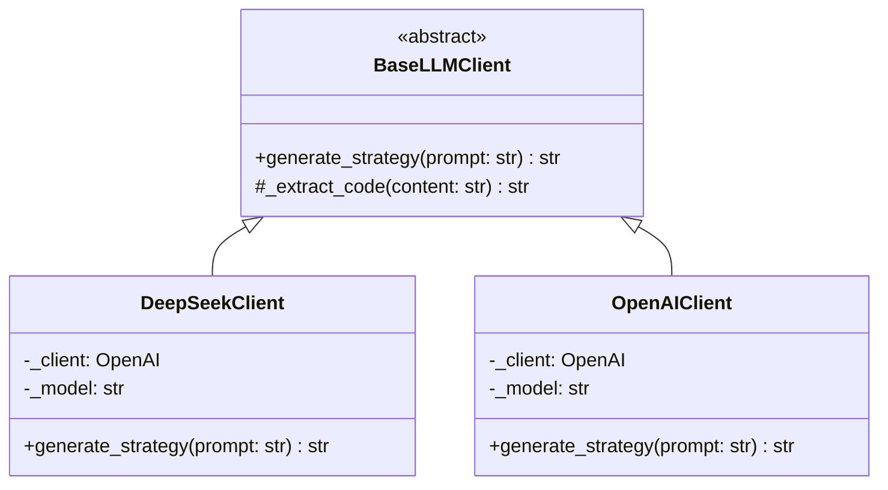
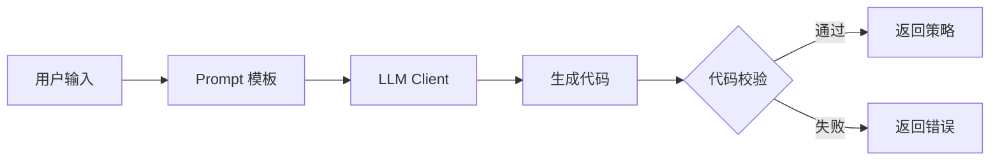

# Step 4: AI 策略生成开发文档

> **目标**: 集成 DeepSeek API，实现自然语言 → Python 策略代码生成

---

## 1. 模块结构

```
src/
├── ai/
│   ├── __init__.py
│   ├── base.py           # 抽象基类 🆕
│   ├── deepseek.py       # DeepSeek 实现
│   ├── openai_client.py  # OpenAI 实现 (预留)
│   ├── prompt.py         # Prompt 模板
│   ├── validator.py      # 代码安全校验
│   └── factory.py        # 工厂方法 🆕
```

---

## 2. 架构设计

### 2.1 类图



### 2.2 功能流程



---

## 3. 代码实现

### 3.1 抽象基类

```python
# src/ai/base.py
"""LLM 客户端抽象基类"""

from abc import ABC, abstractmethod
from typing import Optional


class BaseLLMClient(ABC):
    """LLM 客户端抽象基类
    
    所有 LLM 客户端（DeepSeek, OpenAI, Claude 等）都应继承此类。
    
    Example:
        >>> class ClaudeClient(BaseLLMClient):
        ...     def generate_strategy(self, prompt: str) -> str:
        ...         # Claude 特定实现
        ...         pass
    """
    
    @abstractmethod
    def generate_strategy(
        self,
        user_prompt: str,
        max_tokens: int = 2000
    ) -> str:
        """生成策略代码
        
        Args:
            user_prompt: 用户自然语言描述
            max_tokens: 最大生成 token 数
            
        Returns:
            生成的 Python 策略代码
        """
        pass
    
    def _extract_code(self, content: str) -> str:
        """从响应中提取代码块
        
        子类可重写此方法以适应不同模型的输出格式。
        """
        if "```python" in content:
            start = content.find("```python") + 9
            end = content.find("```", start)
            return content[start:end].strip()
        elif "```" in content:
            start = content.find("```") + 3
            end = content.find("```", start)
            return content[start:end].strip()
        return content.strip()
```

### 3.2 DeepSeek 客户端

```python
# src/ai/deepseek.py
"""DeepSeek API 客户端"""

from openai import OpenAI
from typing import Optional

from .base import BaseLLMClient
from .prompt import SYSTEM_PROMPT


class DeepSeekClient(BaseLLMClient):
    """DeepSeek AI 客户端
    
    使用 OpenAI 兼容 API 调用 DeepSeek 模型。
    
    Example:
        >>> client = DeepSeekClient(api_key="your_key")
        >>> code = client.generate_strategy("EMA 金叉做多")
    """
    
    BASE_URL = "https://api.deepseek.com"
    DEFAULT_MODEL = "deepseek-chat"
    
    def __init__(
        self,
        api_key: str,
        model: str = DEFAULT_MODEL,
        temperature: float = 0.7
    ) -> None:
        """初始化客户端
        
        Args:
            api_key: DeepSeek API Key
            model: 模型名称，默认 deepseek-chat
            temperature: 生成温度，0-1
        """
        self._client = OpenAI(
            api_key=api_key,
            base_url=self.BASE_URL
        )
        self._model = model
        self._temperature = temperature
    
    def generate_strategy(
        self,
        user_prompt: str,
        max_tokens: int = 2000
    ) -> str:
        """生成策略代码
        
        Args:
            user_prompt: 用户自然语言描述
            max_tokens: 最大生成 token 数
            
        Returns:
            生成的 Python 策略代码
            
        Raises:
            RuntimeError: API 调用失败
        """
        try:
            response = self._client.chat.completions.create(
                model=self._model,
                messages=[
                    {"role": "system", "content": SYSTEM_PROMPT},
                    {"role": "user", "content": user_prompt}
                ],
                temperature=self._temperature,
                max_tokens=max_tokens
            )
            return self._extract_code(response.choices[0].message.content)
        except Exception as e:
            raise RuntimeError(f"DeepSeek API 调用失败: {e}")
```

### 3.3 OpenAI 客户端 (预留)

```python
# src/ai/openai_client.py
"""OpenAI API 客户端 (预留实现)"""

from openai import OpenAI
from typing import Optional

from .base import BaseLLMClient
from .prompt import SYSTEM_PROMPT


class OpenAIClient(BaseLLMClient):
    """OpenAI GPT 客户端
    
    Example:
        >>> client = OpenAIClient(api_key="your_key")
        >>> code = client.generate_strategy("EMA 金叉做多")
    """
    
    DEFAULT_MODEL = "gpt-4o"
    
    def __init__(
        self,
        api_key: str,
        model: str = DEFAULT_MODEL,
        temperature: float = 0.7
    ) -> None:
        self._client = OpenAI(api_key=api_key)
        self._model = model
        self._temperature = temperature
    
    def generate_strategy(
        self,
        user_prompt: str,
        max_tokens: int = 2000
    ) -> str:
        try:
            response = self._client.chat.completions.create(
                model=self._model,
                messages=[
                    {"role": "system", "content": SYSTEM_PROMPT},
                    {"role": "user", "content": user_prompt}
                ],
                temperature=self._temperature,
                max_tokens=max_tokens
            )
            return self._extract_code(response.choices[0].message.content)
        except Exception as e:
            raise RuntimeError(f"OpenAI API 调用失败: {e}")
```

### 3.4 工厂方法

```python
# src/ai/factory.py
"""LLM 客户端工厂"""

from enum import Enum
from typing import Optional

from .base import BaseLLMClient
from .deepseek import DeepSeekClient


class LLMProvider(Enum):
    """LLM 提供商枚举"""
    DEEPSEEK = "deepseek"
    OPENAI = "openai"
    CLAUDE = "claude"  # 预留


def create_llm_client(
    provider: LLMProvider,
    api_key: str,
    model: Optional[str] = None,
    **kwargs
) -> BaseLLMClient:
    """创建 LLM 客户端实例
    
    Args:
        provider: LLM 提供商
        api_key: API Key
        model: 模型名称（可选，使用默认）
        **kwargs: 其他参数
        
    Returns:
        LLM 客户端实例
        
    Example:
        >>> client = create_llm_client(LLMProvider.DEEPSEEK, "your_key")
        >>> code = client.generate_strategy("EMA 金叉做多")
    """
    if provider == LLMProvider.DEEPSEEK:
        return DeepSeekClient(api_key=api_key, model=model or DeepSeekClient.DEFAULT_MODEL, **kwargs)
    elif provider == LLMProvider.OPENAI:
        from .openai_client import OpenAIClient
        return OpenAIClient(api_key=api_key, model=model or OpenAIClient.DEFAULT_MODEL, **kwargs)
    else:
        raise ValueError(f"不支持的 LLM 提供商: {provider}")
```

### 3.5 Prompt 模板

```python
# src/ai/prompt.py
"""Prompt 模板"""

SYSTEM_PROMPT = """你是一个量化交易策略开发助手。根据用户的自然语言描述，生成 Python 策略代码。

## 策略代码格式

```python
class Strategy:
    def init(self):
        # 初始化指标
        self.ema20 = EMA(20)
        self.ema60 = EMA(60)
    
    def on_bar(self, bar):
        # 更新指标
        fast = self.ema20.update(bar.close)
        slow = self.ema60.update(bar.close)
        
        # 交易逻辑
        if 买入条件:
            self.order("BTCUSDT", "BUY", 0.1)
        
        if 卖出条件:
            self.close("BTCUSDT")
```

## 可用指标

- `EMA(period)`: 指数移动平均
- `SMA(period)`: 简单移动平均
- `RSI(period)`: 相对强弱指标
- `MACD(fast, slow, signal)`: MACD 指标

## 可用方法

- `self.order(symbol, side, size)`: 下单
  - side: "BUY" 或 "SELL"
  - size: 下单数量
- `self.close(symbol)`: 平仓
- `self.get_position(symbol)`: 获取持仓

## 数据结构

bar 对象包含:
- `bar.timestamp`: 时间戳
- `bar.open`: 开盘价
- `bar.high`: 最高价
- `bar.low`: 最低价
- `bar.close`: 收盘价
- `bar.volume`: 成交量

## 重要规则

1. 只输出策略类代码，不要解释
2. 类名必须是 Strategy
3. 必须实现 init() 和 on_bar() 方法
4. 不要使用 import 语句
5. 不要使用 exec/eval 等危险函数
"""

# 用于生成更复杂策略的扩展模板
ADVANCED_PROMPT = SYSTEM_PROMPT + """

## 高级功能

- 可以使用 self.equity 获取当前资金
- 可以记录历史变量进行趋势判断
- 支持多条件组合判断
"""
```

### 3.6 代码校验器

```python
# src/ai/validator.py
"""策略代码安全校验"""

import ast
from typing import Tuple


# 允许的内置名称
ALLOWED_BUILTINS = {
    'True', 'False', 'None',
    'abs', 'max', 'min', 'len', 'range', 'round',
    'int', 'float', 'str', 'bool', 'list', 'dict',
    'print'
}

# 允许的自定义名称
ALLOWED_NAMES = {
    'Strategy', 'self', 'bar',
    'EMA', 'SMA', 'RSI', 'MACD',
    'order', 'close', 'get_position', 'equity'
}

# 禁止的 AST 节点类型
FORBIDDEN_NODES = {
    ast.Import,
    ast.ImportFrom,
    ast.Global,
    ast.Nonlocal,
    ast.AsyncFunctionDef,
    ast.AsyncFor,
    ast.AsyncWith,
    ast.Await,
}

# 禁止的函数调用
FORBIDDEN_CALLS = {
    'exec', 'eval', 'compile', 'open', 'input',
    '__import__', 'globals', 'locals', 'vars',
    'getattr', 'setattr', 'delattr', 'hasattr',
    'exit', 'quit'
}


def validate_strategy_code(code: str) -> Tuple[bool, str]:
    """验证策略代码安全性
    
    Args:
        code: 策略代码字符串
        
    Returns:
        (是否通过, 错误消息)
    """
    # 1. 语法检查
    try:
        tree = ast.parse(code)
    except SyntaxError as e:
        return False, f"语法错误: {e.msg} (行 {e.lineno})"
    
    # 2. 检查是否有且只有一个 Strategy 类
    classes = [node for node in ast.walk(tree) if isinstance(node, ast.ClassDef)]
    if len(classes) == 0:
        return False, "未找到 Strategy 类定义"
    if len(classes) > 1:
        return False, "只能定义一个类"
    if classes[0].name != "Strategy":
        return False, f"类名必须是 Strategy，而不是 {classes[0].name}"
    
    # 3. 检查必要方法
    strategy_class = classes[0]
    methods = {node.name for node in strategy_class.body if isinstance(node, ast.FunctionDef)}
    if "init" not in methods:
        return False, "缺少 init() 方法"
    if "on_bar" not in methods:
        return False, "缺少 on_bar() 方法"
    
    # 4. 检查禁止的节点
    for node in ast.walk(tree):
        if type(node) in FORBIDDEN_NODES:
            return False, f"不允许使用 {type(node).__name__}"
    
    # 5. 检查禁止的函数调用
    for node in ast.walk(tree):
        if isinstance(node, ast.Call):
            if isinstance(node.func, ast.Name):
                if node.func.id in FORBIDDEN_CALLS:
                    return False, f"不允许调用 {node.func.id}()"
    
    return True, "验证通过"


def execute_strategy_code(code: str) -> object:
    """安全执行策略代码并返回策略实例
    
    Args:
        code: 已验证的策略代码
        
    Returns:
        Strategy 类实例
        
    Raises:
        RuntimeError: 执行失败
    """
    # 创建受限的执行环境
    safe_globals = {
        '__builtins__': {k: getattr(__builtins__, k) for k in ALLOWED_BUILTINS if hasattr(__builtins__, k)},
    }
    safe_locals = {}
    
    try:
        exec(code, safe_globals, safe_locals)
        strategy_class = safe_locals.get('Strategy')
        if strategy_class is None:
            raise RuntimeError("未找到 Strategy 类")
        return strategy_class()
    except Exception as e:
        raise RuntimeError(f"策略代码执行失败: {e}")
```

### 3.7 模块入口

```python
# src/ai/__init__.py
"""AI 策略生成模块"""

from .base import BaseLLMClient
from .deepseek import DeepSeekClient
from .factory import LLMProvider, create_llm_client
from .prompt import SYSTEM_PROMPT, ADVANCED_PROMPT
from .validator import validate_strategy_code, execute_strategy_code

__all__ = [
    "BaseLLMClient",
    "DeepSeekClient",
    "LLMProvider",
    "create_llm_client",
    "SYSTEM_PROMPT",
    "ADVANCED_PROMPT",
    "validate_strategy_code",
    "execute_strategy_code"
]
```

---

## 4. API 端点更新

完成 ai 模块后，更新 `/api/generate` 端点：

```python
# src/api/routes/strategy.py (更新)

from src.ai import LLMProvider, create_llm_client, validate_strategy_code
import os

# 从环境变量获取配置
_llm_client = None

def get_llm_client():
    """获取 LLM 客户端（延迟初始化）"""
    global _llm_client
    if _llm_client is None:
        api_key = os.getenv("DEEPSEEK_API_KEY")
        if not api_key:
            raise RuntimeError("未设置 DEEPSEEK_API_KEY 环境变量")
        
        # 使用工厂方法创建客户端，便于切换模型
        provider = os.getenv("LLM_PROVIDER", "deepseek").lower()
        _llm_client = create_llm_client(
            LLMProvider(provider),
            api_key=api_key
        )
    return _llm_client

@router.post("/generate", response_model=GenerateResponse)
async def generate_strategy(req: GenerateRequest) -> GenerateResponse:
    """AI 生成策略代码"""
    try:
        client = get_llm_client()
        code = client.generate_strategy(req.prompt)
        
        # 验证生成的代码
        is_valid, message = validate_strategy_code(code)
        if not is_valid:
            return GenerateResponse(code=code, message=f"代码校验失败: {message}")
        
        return GenerateResponse(code=code, message="策略生成成功")
    except Exception as e:
        raise HTTPException(status_code=500, detail=str(e))
```

---

## 5. 环境变量

```bash
# .env
DEEPSEEK_API_KEY=your_api_key_here
```

---

## 6. 测试用例

```python
# tests/test_ai/test_validator.py

import pytest
from src.ai.validator import validate_strategy_code

class TestValidator:
    
    def test_valid_strategy(self):
        code = '''
class Strategy:
    def init(self):
        self.ema = EMA(20)
    
    def on_bar(self, bar):
        self.ema.update(bar.close)
'''
        is_valid, msg = validate_strategy_code(code)
        assert is_valid
    
    def test_missing_class(self):
        code = "x = 1"
        is_valid, msg = validate_strategy_code(code)
        assert not is_valid
        assert "未找到 Strategy" in msg
    
    def test_wrong_class_name(self):
        code = "class MyStrategy: pass"
        is_valid, msg = validate_strategy_code(code)
        assert not is_valid
        assert "Strategy" in msg
    
    def test_import_not_allowed(self):
        code = '''
import os
class Strategy:
    def init(self): pass
    def on_bar(self, bar): pass
'''
        is_valid, msg = validate_strategy_code(code)
        assert not is_valid
        assert "Import" in msg
    
    def test_exec_not_allowed(self):
        code = '''
class Strategy:
    def init(self): pass
    def on_bar(self, bar):
        exec("print(1)")
'''
        is_valid, msg = validate_strategy_code(code)
        assert not is_valid
        assert "exec" in msg
```

---

## 7. 完成标准

- [ ] DeepSeek 客户端可正常调用
- [ ] Prompt 模板能生成合格代码
- [ ] 代码校验器能识别危险代码
- [ ] `/api/generate` 端点返回真实 AI 生成结果
- [ ] 单元测试通过
- [ ] 集成测试（真实 API 调用）通过

---

*文档生成日期: 2025-12-10*
