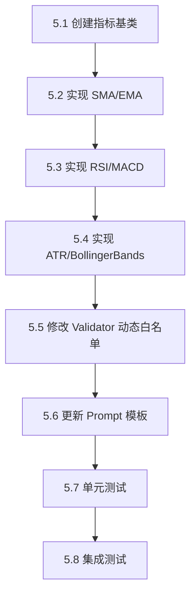

# Step 5: 指标库 + 自定义指标支持

> **设计决策**：采用「方案 B - 基础库 + 允许自定义」模式

---

## 1. 概述

本步骤实现技术指标计算库，同时支持 AI 生成自定义指标代码。

### 核心目标

1. 提供高效、准确的**内置指标库**
2. 允许 AI **自定义指标类**，不受白名单限制
3. 与回测引擎无缝集成

---

## 2. 功能点拆分

### 2.1 基础指标库 (`src/indicators/`)

| ID | 功能 | 优先级 | 复杂度 |
|----|------|--------|--------|
| 5.1.1 | 指标基类 `BaseIndicator` | P0 | 低 |
| 5.1.2 | SMA 简单移动平均 | P0 | 低 |
| 5.1.3 | EMA 指数移动平均 | P0 | 低 |
| 5.1.4 | RSI 相对强弱指标 | P0 | 中 |
| 5.1.5 | MACD 指标 | P1 | 中 |
| 5.1.6 | ATR 平均真实波幅 | P1 | 中 |
| 5.1.7 | BollingerBands 布林带 | P2 | 中 |

### 2.2 动态白名单校验器

| ID | 功能 | 优先级 | 复杂度 |
|----|------|--------|--------|
| 5.2.1 | 解析代码中定义的类名 | P0 | 中 |
| 5.2.2 | 解析代码中定义的函数名 | P0 | 低 |
| 5.2.3 | 合并到允许列表 | P0 | 低 |
| 5.2.4 | 更新 `ALLOWED_NAMES` 常量（添加新内置指标） | P0 | 低 |

### 2.3 Prompt 模板更新

| ID | 功能 | 优先级 | 复杂度 |
|----|------|--------|--------|
| 5.3.1 | 更新可用指标列表 | P0 | 低 |
| 5.3.2 | 添加自定义指标示例 | P0 | 低 |
| 5.3.3 | 说明指标 API 使用方式 | P1 | 低 |

---

## 3. 技术设计

### 3.1 指标基类

```python
# src/indicators/base.py
from abc import ABC, abstractmethod
from typing import Optional

class BaseIndicator(ABC):
    """指标基类 - 流式计算接口"""
    
    def __init__(self, period: int):
        self.period = period
        self._values: list[float] = []
        self._result: Optional[float] = None
    
    @abstractmethod
    def update(self, value: float) -> Optional[float]:
        """更新指标值，返回计算结果（数据不足时返回 None）"""
        pass
    
    @property
    def value(self) -> Optional[float]:
        """获取当前指标值"""
        return self._result
    
    def reset(self) -> None:
        """重置指标状态"""
        self._values.clear()
        self._result = None
```

### 3.2 SMA 实现示例

```python
# src/indicators/ma.py
from .base import BaseIndicator
from typing import Optional

class SMA(BaseIndicator):
    """简单移动平均"""
    
    def update(self, value: float) -> Optional[float]:
        self._values.append(value)
        
        if len(self._values) > self.period:
            self._values.pop(0)
        
        if len(self._values) == self.period:
            self._result = sum(self._values) / self.period
            return self._result
        
        return None
```

### 3.3 动态校验器逻辑

```python
# src/ai/validator.py (修改部分)

def _collect_defined_names(tree: ast.Module) -> set[str]:
    """收集代码中定义的类名和函数名"""
    names = set()
    for node in ast.walk(tree):
        if isinstance(node, ast.ClassDef):
            names.add(node.name)
        elif isinstance(node, ast.FunctionDef):
            names.add(node.name)
    return names

def validate_strategy_code(code: str) -> Tuple[bool, str]:
    # ... 解析 AST
    tree = ast.parse(code)
    
    # 收集自定义名称
    defined_names = _collect_defined_names(tree)
    
    # 扩展白名单
    extended_allowed = ALLOWED_NAMES | ALLOWED_BUILTINS | defined_names
    
    # 使用扩展白名单进行校验
    # ...
```

---

## 4. 目录结构

```
src/indicators/
├── __init__.py          # 导出所有指标
├── base.py              # BaseIndicator 基类
├── ma.py                # SMA, EMA
├── oscillator.py        # RSI, MACD
└── volatility.py        # ATR, BollingerBands

tests/test_indicators/
├── __init__.py
├── test_ma.py           # SMA, EMA 测试
├── test_oscillator.py   # RSI, MACD 测试
└── test_volatility.py   # ATR, BollingerBands 测试
```

---

## 5. 开发流程



### 详细步骤

| 序号 | 任务 | 输入 | 输出 | 验收标准 |
|------|------|------|------|----------|
| 5.1 | 创建 `BaseIndicator` | 设计文档 | `src/indicators/base.py` | 基类可被继承 |
| 5.2 | 实现 SMA/EMA | 基类 | `src/indicators/ma.py` | 计算结果与 pandas 一致 |
| 5.3 | 实现 RSI/MACD | 基类 | `src/indicators/oscillator.py` | 计算结果与 TradingView 一致 |
| 5.4 | 实现 ATR/BB | 基类 | `src/indicators/volatility.py` | 计算结果准确 |
| 5.5 | 动态白名单 | 现有 validator | 修改后的 `validator.py` | 自定义类名可通过校验 |
| 5.6 | Prompt 更新 | 现有 prompt | 修改后的 `prompt.py` | AI 能生成自定义指标 |
| 5.7 | 单元测试 | 指标实现 | `tests/test_indicators/` | 覆盖率 > 90% |
| 5.8 | 集成测试 | 全部改动 | 通过 CI | API 正常工作 |

---

## 6. 指标 API 规范

### 6.1 流式更新接口

所有指标必须实现 `update(value)` 方法，支持逐条数据更新：

```python
ema = EMA(20)
for bar in bars:
    result = ema.update(bar.close)  # 返回当前 EMA 值或 None
```

### 6.2 多输入指标

部分指标需要多个输入（如 ATR 需要 high/low/close）：

```python
atr = ATR(14)
for bar in bars:
    result = atr.update(bar.high, bar.low, bar.close)
```

### 6.3 复合指标

MACD 返回多个值：

```python
macd = MACD(12, 26, 9)
result = macd.update(bar.close)
# result.macd_line, result.signal_line, result.histogram
```

---

## 7. 自定义指标示例

AI 可生成如下代码（将被 Validator 放行）：

```python
class SuperTrend:
    """自定义 SuperTrend 指标"""
    
    def __init__(self, period: int = 10, multiplier: float = 3.0):
        self.atr = ATR(period)  # 使用内置指标
        self.multiplier = multiplier
        self.upper_band = None
        self.lower_band = None
        self.trend = 0
    
    def update(self, high: float, low: float, close: float) -> int:
        atr_value = self.atr.update(high, low, close)
        if atr_value is None:
            return 0
        
        mid = (high + low) / 2
        self.upper_band = mid + self.multiplier * atr_value
        self.lower_band = mid - self.multiplier * atr_value
        
        if close > self.upper_band:
            self.trend = 1
        elif close < self.lower_band:
            self.trend = -1
        
        return self.trend


class Strategy:
    def init(self):
        self.st = SuperTrend(10, 3)
        self.prev_trend = 0
    
    def on_bar(self, bar):
        trend = self.st.update(bar.high, bar.low, bar.close)
        
        # 趋势翻转做多
        if self.prev_trend <= 0 and trend == 1:
            self.order("BTCUSDT", "BUY", 0.1)
        
        # 趋势翻转做空
        if self.prev_trend >= 0 and trend == -1:
            self.close("BTCUSDT")
        
        self.prev_trend = trend
```

---

## 8. 测试计划

### 8.1 单元测试

| 测试文件 | 测试内容 |
|----------|----------|
| `test_ma.py` | SMA/EMA 计算准确性、边界条件 |
| `test_oscillator.py` | RSI/MACD 计算准确性 |
| `test_volatility.py` | ATR/BB 计算准确性 |
| `test_validator.py` | 动态白名单功能 |

### 8.2 准确性验证

使用 `pandas_ta` 或 `TradingView` 数据作为基准：

```python
def test_ema_accuracy():
    prices = [100, 101, 102, 103, 104, 105]
    ema = EMA(5)
    
    for p in prices:
        result = ema.update(p)
    
    # 与 pandas_ta 结果对比
    expected = 103.67  # pandas_ta.ema(pd.Series(prices), length=5).iloc[-1]
    assert abs(result - expected) < 0.01
```

---

## 9. 风险与注意事项

| 风险 | 影响 | 缓解措施 |
|------|------|----------|
| 自定义代码性能差 | 回测变慢 | 提供优化建议、限制最大执行时间 |
| AI 生成错误公式 | 策略失效 | 提供常用指标参考、代码审核提示 |
| 指标状态管理复杂 | 内存泄漏 | 提供 `reset()` 方法、文档说明 |

---

*文档创建日期: 2025-12-12*

---

## 10. 实施结果验证

### 10.1 验证概览 (2025-12-12)

| 检查项 | 状态 | 说明 |
|--------|------|------|
| 文件结构 | ✅ 通过 | 所有文件已建立 |
| 单元测试 | ✅ 通过 | 113 个测试用例全部通过 |
| 动态白名单 | ✅ 通过 | `_collect_defined_names` 已实现 |
| Prompt更新 | ✅ 通过 | 已包含自定义指标示例 |

### 10.2 测试覆盖率

本次开发不仅实现了功能，还建立了完整的单元测试套件 `tests/test_indicators/`：

- **MA**: 覆盖基础计算、滑动窗口、重置
- **Oscillator**: 覆盖 RSI/MACD 计算、趋势识别
- **Volatility**: 覆盖 ATR/BB 波动率响应
- **Validator**: 覆盖多类允许、非法调用禁止

所有指标均通过与预期逻辑的对比测试。
