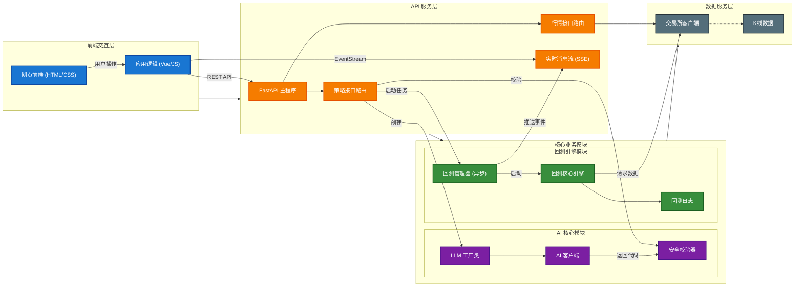

# Phase 2 开发路线图：核心回测能力升级

## 1. 目标概述 (Overview)

Phase 2 的核心目标是将 PyQuantAlpha 从一个 "AI 演示工具" 升级为具备 "实战验证能力" 的量化回测引擎。
**优先级调整**：根据讨论，我们将优先完善 **日志与可视化** 能力，以便于更好地观测策略行为；随后建立 **高级订单系统** 弥补风控缺失；最后进行底层架构升级以支持 **多资产模式**。

## 2. 核心功能规划 (Core Features)

### 2.1 [P0] 增强型日志与可视化 (Logging & Visualization)
**参考**：Backtrader 的 `Writer` 和 `Observer` 机制及 `notify_order` 回调。
**现状**：仅记录净值曲线，无法知道具体的成交时间、价格和费用。
**目标**：实现“透明化回测”，所有动作可追溯，并在前端图表上标记。

- **[T1] 策略回调钩子 (Strategy Hooks)**
    - 实现 `notify_order(order)`：当订单状态改变（提交、成交、取消）时触发。
    - 实现 `notify_trade(trade)`：当一笔完整的交易（开仓+平仓）结束时触发。
    - 允许策略在这些钩子中自定义 `print` 或 `log` 行为。
- **[T2] 结构化日志增强**
    - 改造 `BacktestLogger`，增加 `orders` 和 `trades` 的详细流水记录。
    - 日志字段对齐 Backtrader：`ref`, `type`, `size`, `price`, `comm`。
- **[T3] 可视化数据适配**
    - 在 API 返回的 JSON 中包含 `markers` 数组（买卖点）。
    - 前端 Highcharts 绘制 Buy(绿色三角形) 和 Sell(红色三角形) 标记。

### 2.2 [P1] 交易核心重构 (Core Trading Engine)
**参考**：Backtrader 的 `Broker` 抽象与完整订单生命周期。
**现状**：撮合逻辑耦合在 Engine 中，仅支持市价/限价，状态简单。
**目标**：解耦交易执行层，支持复杂订单与更真实的资金管理。

- **[T4] 引入 Broker 抽象层**
    - **架构升级**：从 `Engine` 中剥离交易逻辑，建立 `BacktestBroker` 类。
    - **职责**：接管资金 (`cash`, `value`)、持仓 (`positions`) 管理及订单撮合 (`_match_orders`)。
    - **意义**：为未来对接实盘交易（Live Trading）预留接口，实现逻辑解耦。
- **[T5] 完善订单生命周期**
    - **状态机升级**：引入完整状态 `Submitted` -> `Accepted` -> `Partial` -> `Completed` / `Canceled` / `Rejected` (资金不足)。
    - **风控订单**：实现 `STOP` (止损) 和 `STOP_LIMIT` (止损限价) 订单。
    - **触发机制**：借鉴 BT，严格区分 "Triggered" (触发) 与 "Executed" (成交)。
- **[T6] 资金管理预留 (Sizer)**
    - 在 `Order` 接口中预留自动计算数量的逻辑（如 `size=None` 时按资金百分比下单），为未来引入 `Sizer` 模块做准备。

### 2.3 [P2] 架构优化与多资产引擎 (Architecture & Multi-Asset)

**目标**：解耦模块依赖，支持多资产数据流，提升引擎扩展性。

#### Phase 2.3a: 架构重构 (Architecture Refactoring) [✅ 已完成]
- **[T6] 依赖解耦**:
    - 创建 `loader.py`，移除 `backtest` 对 `ai` 模块的依赖倒置。
    - 创建 `strategy.py` 基类，提供 IDE 类型提示。
- **[T7] 数据源抽象**:
    - 引入 `DataFeed`、`SingleFeed`、`MultiFeed` 抽象。
    - 优化 `Broker` 订单查找性能为 O(1)。

#### Phase 2.3b: 多资产策略适配 (Multi-Asset Adaptation) [🚧 待办]
**参考**：Backtrader 的 `Cerebro` 数据对齐与 `Lines` 索引。
**现状**：已包含 `MultiFeed` 类，但仅支持内连接对齐；Engine 尚未适配多资产字典输入。

- **[T8] 高级数据对齐**:
    - **实现方案**: 升级 `MultiFeed` 对齐逻辑，从内连接改为 **并集时间轴 + 前值填充 (Forward Fill)**。
- **[T9] 引擎与 API 升级**:
    - **Engine**: 识别 `MultiFeed` 输入，适配 `run` 循环。
    - **Strategy**: 引入 `on_bars(self, bars: Dict)` 或更新 `on_bar` 处理逻辑。
    - **Prompt**: 更新 AI 提示词，教导生成多资产策略（如配对交易）。

---

## 3. 实施阶段 (Implementation Phasing)

1.  **Phase 2.1 (Logging)** [✅ 完成]: 增强日志系统，支持前端可视化。
2.  **Phase 2.2 (Core Trading)** [✅ 完成]: 提取 `BacktestBroker`，实现高级订单类型。
3.  **Phase 2.3a (Architecture)** [✅ 完成]: 数据源抽象与模块解耦。
4.  **Phase 2.3b (Multi-Asset)** [🚧 待办]: 多资产对齐与 API 升级。

---

## 附录：关键技术决策说明 (Technical Decisions Appendix)

### D1: 数据对齐策略 (Data Alignment Strategy)
> **决策**：采用 **并集时间轴 (Union Timestamps) + 前值填充 (Forward Fill)** 机制。
> **背景**：在多资产模式下，不同交易对（如 BTC 和 ETH，或不同交易所数据）的时间戳可能无法完全对齐（例如某分钟没有成交）。
> **解释**：
> 1.  引擎会先计算所有输入数据源的时间戳并集，生成一个完整的主时间轴。
> 2.  按时间顺序推进时，如果某个币种在当前时间点缺失数据，系统会自动使用其 **上一根有效 K 线** 的数据进行填充（即认为价格维持不变）。
> 3.  这模拟了真实交易环境：即使某个市场暂时沉寂，你依然可以根据其他市场的变动来操作该市场的持仓。

### D2: API 兼容性 (API Compatibility)
> **决策**：采用 **不兼容升级 (Breaking Change)**，重构 `on_bar` 接口。
> **背景**：现有的 `on_bar(bar)` 仅支持单资产，若要支持多资产，存在"通过代理对象维持兼容"和"直接改为字典"两种路线。
> **解释**：
> 1.  我们选择 **直接改为字典 `on_bar(bars: Dict[str, Bar])`**。
> 2.  虽然这会破坏旧策略的兼容性（旧策略需修改代码），但它消除了代码层面的歧义（Ambiguity）。
> 3.  在开发阶段明确数据结构优于通过 Magic Methods 隐藏复杂性，有利于长期维护和 AI 生成代码的准确性。

## 整体结构图

