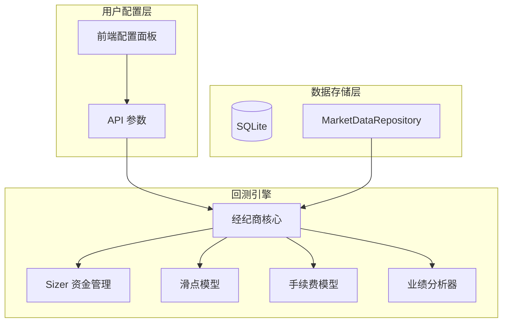

# Phase 3 开发路线图：数据库集成与引擎增强

> **最后更新**: 2025-12-26
> **状态**: Phase 3.3 已完成 ✅

## 1. 目标概述 (Overview)

Phase 3 的核心目标是构建稳健的本地数据持久化层，解决重复下载相同数据的问题，并基于丰富的数据维度大幅扩张回测引擎的风控、仿真真实度与评价能力。

## 2. 核心功能规划 (Core Features)

### 2.1 [P0] 数据库集成与数据持久化 ✅ 已完成

| 任务 | 状态 | 说明 |
|------|------|------|
| T1: 基础设施搭建 | ✅ | SQLite + WAL 模式, ORM 模型定义 |
| T2: 数据仓库层 | ✅ | MarketDataRepository 透明同步 |
| T3: 增量补全逻辑 | ✅ | 自动检测并补全缺失数据 |

### 2.2 [P1] 数据增强与指标库 ✅ 已完成

| 任务 | 状态 | 说明 |
|------|------|------|
| T4: 合约衍生数据 | ✅ | 资金费率、多空比入库 |
| T5: 指标库深度扩张 | ✅ | ADX, Ichimoku, Stochastic, CCI, OBV 等 |
| T6: 多周期同步 | ✅ | Resampler + TimeframeAlignedFeed |

### 2.3 [P1] 交易引擎强化 ✅ 已完成

| 任务 | 状态 | 说明 |
|------|------|------|
| T7: Sizer 资金管理 | ✅ | FixedSize, PercentSize, AllIn, RiskSize |
| T8: 高级风控订单 | ✅ | TrailingStop, Bracket Order, OCO |
| T9: 专业仿真度 | ✅ | 滑点模型、手续费模型 |
| T9.1: AI 提示词更新 | ✅ | setsizer/trailing_stop/bracket API 文档 |

### 2.4 [P2] 业绩评价系统 ✅ 已完成

| 任务 | 状态 | 说明 |
|------|------|------|
| T10: 标准化分析器集 | ✅ | Sharpe, Sortino, Calmar, DD, Returns, Trades |
| T11: 基准对比 | ⏭️ | 跳过（未来按需实现） |

### 2.5 [P2] 用户配置增强 ✅ 已完成

| 任务 | 状态 | 说明 |
|------|------|------|
| T12: 策略内资金配置 | ✅ | `self.set_capital()` API |
| T13: 日志系统增强 | ✅ | Bracket/OCO/Trail 订单详细日志 |

### 2.6 [P3] 可视化增强 📋 规划中

> 详见 [STEP5_VISUALIZATION_ENHANCEMENT.md](./STEP5_VISUALIZATION_ENHANCEMENT.md)

| 任务 | 状态 | 说明 |
|------|------|------|
| T14: 手续费/滑点 UI | 📋 | 前端配置面板 |
| T15: 初始资金 UI | 📋 | 前端可选输入 |

---

## 3. 实施阶段 (Implementation Phasing)

| 阶段 | 主题 | 状态 | 测试 |
|------|------|------|------|
| 3.1 | 数据库基础设施 | ✅ 已完成 | 46 tests |
| 3.2 | 数据增强与指标 | ✅ 已完成 | +30 tests |
| 3.3 | 交易引擎强化 | ✅ 已完成 | +68 tests |
| 3.4 | 业绩评价系统 | ✅ 已完成 | +21 tests |
| 3.5 | 用户配置增强 | ✅ 已完成 | +4 tests |
| 3.6 | 可视化增强 | ✅ 已完成 | T14-T15 |

**当前测试统计**: 470 tests passed, 4 skipped

---

## 4. Phase 3.5 用户配置增强 (详细规划)

### T12: 初始资金自定义配置

**背景**: 初始资金影响仓位计算（PercentSize, RiskSize）和收益率计算。目前代码层支持，但 API 和前端未暴露。

**实现计划**:

1. **API 层** (`src/api/main.py`)
   ```python
   @app.post("/api/backtest/run")
   async def run_backtest(
       code: str,
       symbol: str,
       interval: str = "1h",
       days: int = 30,
       initial_capital: float = 100000.0,  # 新增参数
       commission_rate: float = 0.001,
       slippage: float = 0.0005
   ):
   ```

2. **前端** (`web/js/api.js`)
   - 增加初始资金输入框
   - 默认值 100,000

3. **验证**
   - 最小资金限制（防止 0 或负数）
   - 最大资金限制（防止溢出）

---

## 附录：关键技术决策说明

### D3: 数据库并发模型
> **决策**: SQLite + WAL 模式。允许一个写者不阻塞多个读者。

### D4: 灵活仓位计算
> **决策**: 独立 Sizer 抽象层。将"交易什么"与"交易多少"解耦。

### D5: 多周期数据对齐
> **决策**: 自适应时间戳合并，严格杜绝未来函数风险。

---

## 核心架构演进图


