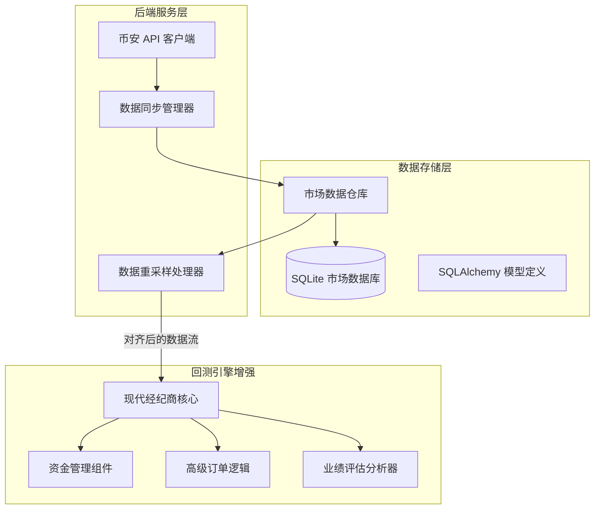

# Phase 3 开发路线图：数据库集成与引擎增强

## 1. 目标概述 (Overview)

Phase 3 的核心目标是构建稳健的本地数据持久化层，解决重复下载相同数据的问题，并基于丰富的数据维度大幅扩张回测引擎的风控、仿真真实度与评价能力。
**优先级调整**：我们将首先完成 **数据库基础设施** 的搭建以解决效率瓶颈；随后引入 **数据增强与指标库**；最后通过 **引擎强化与专业化打磨** 补齐与专业框架的差距。

## 2. 核心功能规划 (Core Features)

### 2.1 [P0] 数据库集成与数据持久化 (Database & Persistence)
**参考**：SQLAlchemy ORM 模式与 Repository 仓库模式。
**现状**：每次回测需实时拉取 K 线，受限于交易所频率限制（Rate Limit），且无法存储自定义非标准数据（如资金费率）。
**目标**：实现数据的“一次采集，永久使用”，并为进阶分析提供高性能查询底座。

- **[T1] 基础设施搭建**
    - 实现 `src/database/database.py`: 连接管理及 WAL 并发模式配置。
    - 实现 `src/database/models.py`: 定义 `Candlestick`, `FundingRate`, `Sentiment` 等 ORM 模型。
- **[T2] 数据仓库层实现 (Repository)**
    - 开发 `MarketDataRepository`: 支持“透明同步 (Lazy Sync)”——优先查库，缺失时补全并回写。
    - 实现 API 路由 `POST /api/klines/sync`: 支持手动触发特定范围的数据同步。
- **[T3] 增量补全逻辑**
    - 改造 `BinanceClient` 解析器，确保 11+ 原始字段无损存库，并支持根据库中最后一条记录自动补全。

### 2.2 [P1] 数据增强与指标库 (Data Enrichment & Indicators)
**参考**：币安合约接口 (Binance Futures API) 及 TA-Lib/Backtrader 指标库。
**现状**：目前策略能见度仅限于 O/H/L/C/V 基础字段，缺乏市场情绪与衍生品维度。

- **[T4] 合约衍生数据对接**
    - 实现历史资金费率 (`funding_rates`) 的采集与入库。
    - 实现市场情绪（全局多空比、大户持仓比）的历史数据追踪。
- **[T5] 指标库深度扩张**
    - **技术指标**: ADX, Ichimoku, Stochastic, Williams %R, CCI, OBV。
    - **情绪指标**: 基于多空比分歧的逆向指标引擎。
- **[T6] 数据进阶处理逻辑**
    - 实现 **数据重采样 (Resampling)**: 支持从 1min 基础数据动态合成任意高周期级别。
    - 实现 **多周期同步 (Multi-Timeframe)**: 在同一回测进程中精准对齐不同周期。

### 2.3 [P1] 交易引擎强化 (Engine Fortification)
**参考**：Backtrader 的 `Sizer` 体系与复杂订单撮合逻辑。
**现状**：仅支持固定仓位，缺乏自动化风险控制与专业仿真模型。

- **[T7] Sizer 资金管理体系**
    - 实现 `BaseSizer` 抽象及其子类：`FixedSize`, `PercentSize`, `RiskSize` (基于 ATR)。
    - 在策略层提供 `setsizer()` API。
- **[T8] 高级风控订单**
    - 实现 `TrailingStop` (移动止损) 逻辑，支持 Broker 端的动态追踪调整。
    - 实现 `Bracket Order` (挂钩订单) 自动化流水线。
- **[T9] 专业仿真度提升**
    - **模型扩展**: 实现 `FixedSlippage` / `PercentSlippage` 滑点模型。
    - **成本核算**: 支持按币种/成交额配置 Maker/Taker 费率。
    - **合约仿真**: 实现基本的杠杆管理与资金费结算逻辑。

### 2.4 [P2] 业绩评价系统 (Analyzers & Evaluation)
**参考**：Backtrader 的 `Analyzers` 评价系统。
**现状**：回测结束仅有净值曲线，无法量化策略优劣。

- **[T10] 标准化分析器集**
    - 实现 Sharpe Ratio, Max Drawdown, Win Rate, Profit Factor 等指标的自动计算。
- **[T11] 基准对比 (Benchmark)**
    - 支持在 equity curve 中引入 BTC 或主流指数作为对标基准。

---

## 3. 实施阶段 (Implementation Phasing)

1.  **Phase 3.1 (Foundation)** [🚧 进行中]: 数据库基础设施与增量同步逻辑。
2.  **Phase 3.2 (Data Enrichment)**: 衍生品数据对接与指标库大幅扩张。
3.  **Phase 3.3 (Engine & Risk)**: Sizer 体系、高级订单与滑点模型。
4.  **Phase 3.4 (Polishing)**: 性能分析器与多周期数据处理。

---

## 附录：关键技术决策说明 (Technical Decisions Appendix)

### D3: 数据库并发模型选择
> **决策**：采用 **SQLite + WAL (Write-Ahead Logging) 模式**。
> **背景**：在后台同步数据（写入）的同时，用户可能正在进行策略回测（读取）。
> **解释**：WAL 模式允许一个写者不阻塞多个读者，极大提升了回测与同步任务并发时的响应速度。此外，由于量化数据通常是顺序增长且一次写入多次读取，SQLite 的性能损耗可忽略不计。

### D4: 灵活的仓位计算 (Flexible Sizing)
> **决策**：引入独立于订单的 **Sizer 抽象层**。
> **解释**：通过将“交易什么” (Strategy) 与“交易多少” (Sizer) 解耦，用户只需编写一次逻辑，即可在不同的资产规模下通过配置 Sizer 来适配资金管理方案，无需在策略代码中硬编码下单数量。

### D5: 多周期数据对齐
> **决策**：采用 **自适应时间戳合并 (Dynamic Timestamp Merging)**。
> **解释**：当运行 5min 策略并参考 1h 周期时，系统会确保 1h 的 Bar 仅在其周期结束的时间点对策略可见，从而严格杜绝“未来函数”风险。

---

## 核心架构演进图

