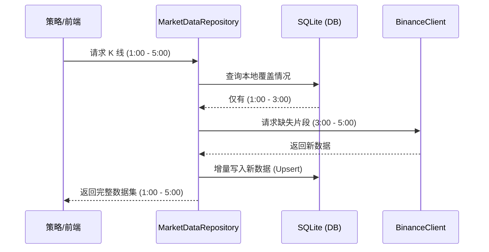

# Phase 3 Step 1: 数据库集成与增量同步方案

## 1. 目标

实现本地 SQLite 数据底座，支持 K 线数据的无损存储与透明化同步（Lazy Sync），大幅提升回测效率。

> [!CAUTION]
> **设计原则：不保证向后兼容 (Breaking Changes Allowed)**
> 为了实现最简洁、高性能的架构，本项目在 Phase 3 中**不考虑向后兼容**。允许破坏旧版 `Bar` 模型定义、API 响应格式以及现有的数据处理流程。

---

## 2. 目录结构

```
src/
├── database/
│   ├── __init__.py           # 模块导出
│   ├── database.py           # 连接管理 + WAL 配置
│   └── models.py             # Candlestick ORM 模型
└── data/
    ├── __init__.py           # 模块导出 (更新)
    ├── models.py             # Bar 数据类 (升级)
    ├── binance.py            # BinanceClient (改造解析逻辑)
    └── repository.py         # MarketDataRepository [NEW]
```

---

## 3. 依赖项

需要添加到 `requirements.txt` 和 `pyproject.toml`：

```
sqlalchemy>=2.0.0      # ORM 框架
aiosqlite>=0.19.0      # 异步 SQLite 驱动
```

---

## 4. 功能拆分

### 4.1 基础设施层 (`src/database/`)

#### [MODIFY] [database.py](file:///Users/lixiansheng/Downloads/PyQuantAlpha/src/database/database.py)

- 使用 SQLAlchemy 创建异步引擎
- 默认开启 WAL (Write-Ahead Logging) 模式以支持并发读写
- 提供 `get_session()` 依赖注入函数

#### [NEW] [models.py](file:///Users/lixiansheng/Downloads/PyQuantAlpha/src/database/models.py)

定义 `Candlestick` ORM 模型，主键为 `(symbol, interval, timestamp)`：

| 字段 | 类型 | 说明 |
|---|---|---|
| symbol | VARCHAR(20) | 交易对 (PK) |
| interval | VARCHAR(10) | 时间周期 (PK) |
| timestamp | BIGINT | 开盘时间戳 ms (PK) |
| open | DECIMAL(18,8) | 开盘价 |
| high | DECIMAL(18,8) | 最高价 |
| low | DECIMAL(18,8) | 最低价 |
| close | DECIMAL(18,8) | 收盘价 |
| volume | DECIMAL(24,8) | 成交量 (Base) |
| close_time | BIGINT | 收盘时间戳 |
| quote_volume | DECIMAL(24,8) | 成交额 (Quote) |
| trade_count | INT | 成交笔数 |
| taker_buy_base | DECIMAL(24,8) | 主动买入量 (Base) |
| taker_buy_quote | DECIMAL(24,8) | 主动买入额 (Quote) |

### 4.2 数据访问层 (`src/data/repository.py`)

#### [NEW] [repository.py](file:///Users/lixiansheng/Downloads/PyQuantAlpha/src/data/repository.py)

**仓库模式**: 建立 `MarketDataRepository` 充当数据访问的单一入口。

**透明化逻辑** (`get_klines`):
1. 检查库中覆盖范围
2. 若有缺失片段，调用 `BinanceClient` 获取
3. 增量写入数据库 (Upsert)
4. 返回合并后的数据

### 4.3 业务集成层

#### [MODIFY] [models.py](file:///Users/lixiansheng/Downloads/PyQuantAlpha/src/data/models.py)

升级 `Bar` 类，增加专业字段：

```python
@dataclass
class Bar:
    timestamp: int
    open: float
    high: float
    low: float
    close: float
    volume: float
    # === Phase 3 新增 ===
    close_time: int = 0
    quote_volume: float = 0.0
    trade_count: int = 0
    taker_buy_base: float = 0.0
    taker_buy_quote: float = 0.0
```

#### [MODIFY] [binance.py](file:///Users/lixiansheng/Downloads/PyQuantAlpha/src/data/binance.py)

改造 `_parse_klines` 解析逻辑，不再丢弃非核心字段，保留币安返回的全部 11 个字段。

#### [MODIFY] [klines.py](file:///Users/lixiansheng/Downloads/PyQuantAlpha/src/api/routes/klines.py)

新增 `POST /api/klines/sync` 接口，允许前端或定时任务显式刷新数据片段。

---

## 5. 技术流程图 (Flow)



---

## 6. 集成点说明

### 回测引擎集成

```python
# 改造前：直接调用 Client
bars = BinanceClient().get_klines("BTCUSDT", "1h", limit=1000)

# 改造后：通过 Repository（自动缓存）
repo = MarketDataRepository()
bars = await repo.get_klines("BTCUSDT", "1h", start=start_ts, end=end_ts)
```

### API 层集成

- `/api/klines` 和 `/api/klines/historical` 内部改为调用 `MarketDataRepository`
- `/api/backtest/run` 已集成透明缓存 ✅
  - 首次回测：从 Binance 拉取 + 写入 SQLite
  - 后续相同参数回测：直接从本地读取（快 200+ 倍）
- 新增 `/api/klines/sync` 用于手动触发同步

---

## 7. 错误处理策略

| 场景 | 行为 |
|---|---|
| 网络断开 + 库中有部分数据 | 返回已有数据 + 在响应中添加 `partial: true` 标记 |
| 网络断开 + 库中无数据 | 抛出 `ConnectionError` |
| 数据库文件损坏 | 自动删除并重建空数据库，记录警告日志 |
| 币安 API 限流 (429) | 等待 `Retry-After` 后重试，最多 3 次 |

---

## 8. 实施里程碑

| 阶段 | 任务 | 交付物 |
|---|---|---|
| **M1** | 基础设施 | `database.py` + `models.py` (ORM) |
| **M2** | Repository | `repository.py` + 透明同步逻辑 |
| **M3** | 模型对齐 | 升级 `Bar` + 改造 `BinanceClient` |
| **M4** | API 部署 | `POST /api/klines/sync` 接口 |

---

## 9. 验证计划

### 9.1 自动化测试

#### 测试文件清单

| 文件 | 覆盖模块 | 测试内容 |
|---|---|---|
| `tests/test_database/test_database.py` | `src/database/database.py` | 引擎创建、WAL 模式、会话管理 |
| `tests/test_database/test_models.py` | `src/database/models.py` | Candlestick ORM CRUD |
| `tests/test_data/test_repository.py` | `src/data/repository.py` | 透明同步、覆盖范围查询 |
| `tests/test_data/test_bar_model.py` | `src/data/models.py` | Bar 类 11 字段、to_dict 方法 |

#### 运行命令

```bash
# 数据库单元测试
pytest tests/test_database/ -v

# Repository 测试
pytest tests/test_data/test_repository.py -v

# Bar 模型测试
pytest tests/test_data/test_bar_model.py -v

# 全部 Step 1 相关测试
pytest tests/test_database/ tests/test_data/test_repository.py tests/test_data/test_bar_model.py -v
```

### 9.2 性能指标

#### 运行性能测试

```bash
# 运行性能基准测试（需要网络）
pytest tests/test_data/test_performance.py -v -s --run-benchmark
```

#### 测试结果 (2025-12-22)

| 测试项 | 目标 | 实测结果 | 状态 |
|---|---|---|---|
| 冷启动 (30 天数据) | < 5s | **0.88s** | ✅ |
| 热启动 (缓存命中) | < 100ms | **12.3ms** | ✅ |
| 加速倍数 | >= 10x | **224.8x** | ✅ |
| DB 读取延迟 | < 500ms | **10.2ms** | ✅ |

> [!TIP]
> 缓存读取比网络请求快了 **224 倍**，远超预期目标。

### 9.3 一致性校验

- 对比数据库记录与币安 API 原始响应，确保 11 个字段完全一致
- 使用 `assert bar.close == raw_data[4]` 逐字段验证

### 9.4 异常场景测试

- 模拟网络断开时，已有数据能正常返回 (Partial Success)
- 模拟请求范围超出库存数据时，自动补全并合并

---

## 10. 完成状态

- [x] M1: 基础设施层 ✅
- [x] M2: Repository 实现 ✅
- [x] M3: 模型对齐 ✅
- [x] M4: API 部署 ✅
- [x] 单元测试 ✅ (46 测试用例)
- [x] 性能测试 ✅ (4 项指标全部达标)
- [x] 文档更新 ✅

### 测试统计

| 测试文件 | 通过 | 说明 |
|---|---|---|
| `test_database/test_database.py` | 13 | 引擎、会话、初始化 |
| `test_database/test_models.py` | 5 | ORM CRUD |
| `test_data/test_repository.py` | 12 | 透明同步 |
| `test_data/test_bar_model.py` | 11 | Bar 模型 |
| `test_data/test_performance.py` | 5 | 性能基准 |
| **合计** | **46** | |

> **状态**: 🎉 **已完成** (2025-12-22)


