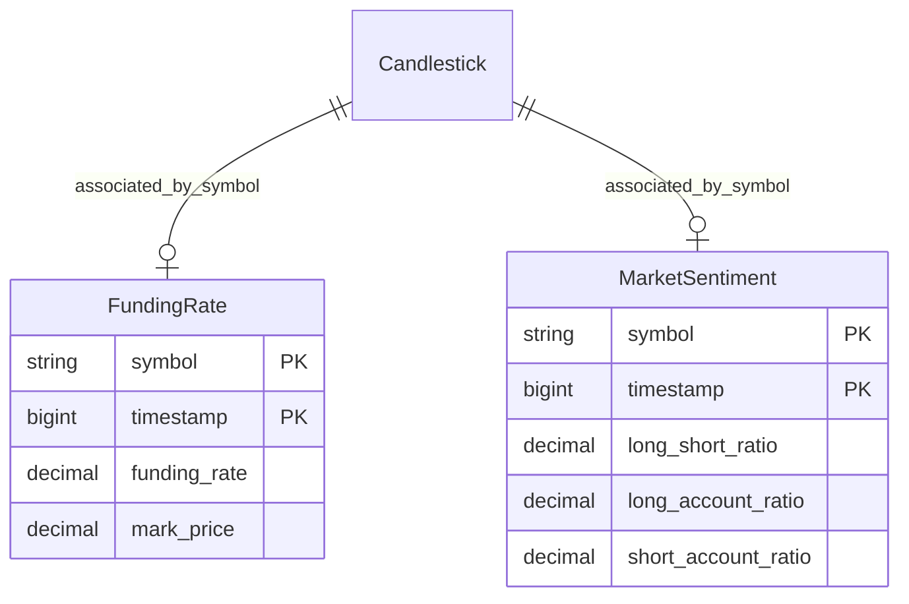
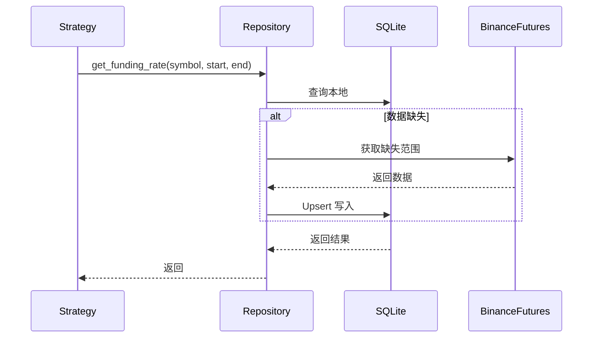

# Phase 3 - Step 2: 数据增强与指标库 (STEP2_DATA_ENRICHMENT)

## 1. 概述 (Overview)
Step 2 的目标是在基础 K 线数据库之上，引入**衍生品维度**（资金费率、多空比）和**高阶指标**，并提供**数据重采样**与**多周期对齐**能力。这将使策略能够"感知"市场情绪、观察衍生品博弈，并跨周期协作。

---

## 2. 核心功能明细

### 2.1 合约衍生数据 (T4)
目前回测仅使用基础 K 线。引入合约数据能显著提升震荡市的策略表现。

#### 2.1.1 资金费率 (Funding Rate)
| 项目 | 说明 |
|-----|------|
| **接口** | Binance Futures `GET /fapi/v1/fundingRate` |
| **Base URL** | `https://fapi.binance.com` (需新增 Futures 客户端) |
| **用途** | 判断收租/付息成本及市场极端偏向 |

**ORM 模型 `FundingRate`**:
```python
class FundingRate(Base):
    __tablename__ = "funding_rates"
    symbol = Column(String(20), primary_key=True)
    timestamp = Column(BigInteger, primary_key=True)  # fundingTime
    funding_rate = Column(Numeric(18, 8))
    mark_price = Column(Numeric(18, 8))  # 标记价格
```

#### 2.1.2 市场情绪 (Sentiment)
| 项目 | 说明 |
|-----|------|
| **接口** | `GET /futures/data/globalLongShortAccountRatio` |
| **用途** | 判断大户与散户的分歧 |

**ORM 模型 `MarketSentiment`**:
```python
class MarketSentiment(Base):
    __tablename__ = "market_sentiment"
    symbol = Column(String(20), primary_key=True)
    timestamp = Column(BigInteger, primary_key=True)
    long_short_ratio = Column(Numeric(10, 4))       # 多空比
    long_account_ratio = Column(Numeric(10, 4))     # 多头账户占比
    short_account_ratio = Column(Numeric(10, 4))    # 空头账户占比
```

### 2.2 指标库扩张 (T5)
补齐常用量化指标：
- **趋势型**: ADX (平滑平均趋向指标), Ichimoku (一目均衡表)
- **动量型**: Stochastic (随机指标), Williams %R (威廉指标), CCI (顺势指标)
- **成交量型**: OBV (能量潮指标)
- **自定义情感指标**: `SentimentDisparity` (价格与多空比的背离度)

### 2.3 数据处理逻辑 (T6) 🚀
这是本阶段最核心的底层增强：

#### 数据重采样 (Resampling)
- 输入 1m 数据，通过算法合成任意周期（如 3m, 7m, 1h, 4h）
- 算法: `Open(first), High(max), Low(min), Close(last), Volume(sum)`

#### 多周期对齐 (Multi-Timeframe)
- 确保小周期在调用大周期数据时，只能看到"已收盘"的大周期 Bar
- **严防未来函数**: 5min 时间点的策略如果查询 1h Bar，需返回 1h 前（已结束）的 Bar 数据

---

## 3. 技术架构

### 3.1 客户端架构
```
src/data/
├── base.py           # BaseExchangeClient (已有)
├── binance.py        # BinanceClient - 现货 API
└── binance_futures.py  # BinanceFuturesClient - 合约 API (新增)
```

> **关键**: 合约 API 使用 `fapi.binance.com`，与现货 `api.binance.com` 不同。

### 3.2 数据库架构扩展


### 3.3 衍生数据流 (Lazy Sync)


---

## 4. 存储与性能估算

### 4.1 数据量预估

| 数据类型 | 每交易对/年 | 10 交易对/年 | 单条大小 |
|---------|------------|-------------|---------|
| **1m K 线** | 525,600 条 | ~5.26M 条 | ~100B |
| **资金费率** | 1,095 条 (8h 一次) | ~11K 条 | ~50B |
| **情绪数据** | 8,760 条 (1h 一次) | ~88K 条 | ~60B |

### 4.2 存储容量

| 场景 | 预估大小 |
|-----|---------|
| 10 交易对 1m 数据 1 年 | ~500 MB |
| 10 交易对衍生数据 1 年 | ~10 MB |
| **总计 (2 年历史)** | **~1 GB** |

> SQLite 单库可支撑 TB 级别，无需担心容量问题。

### 4.3 采集策略

由于 1m 数据量大，建议采用**按需采集**而非全量预同步：
1. 用户发起重采样请求时才拉取对应范围的 1m 数据
2. 衍生数据（资金费率、情绪）体积小，可后台定时同步

---

## 5. 优先级与计划

考虑到依赖关系，调整为：

| 阶段 | 任务 | 依赖 | 说明 |
|-----|------|------|------|
| **M1** | 新增 `BinanceFuturesClient` | - | 合约 API 基础 |
| **M2** | 实现 `FundingRate` + `MarketSentiment` 模型及同步 | M1 | 衍生数据入库 |
| **M3** | 实现数据重采样 (Resampling) | - | 1m → 任意周期 |
| **M4** | 实现多周期对齐 | M3 | 杜绝未来函数 |
| **M5** | 指标库扩张 | - | ADX, Ichimoku 等 |

---

## 6. 验证标准 (Verification Results)

- [x] 1m 重采样结果与 Binance 原始数据 OHLCV 一致
- [x] 多周期回测中，大周期数据（1h, 4h）的更新频率符合对齐逻辑（防未来函数）
- [x] 资金费率 Lazy Sync 成功入库，本地查询延迟 < 50ms
- [x] 情绪数据（多空比）正确存储，支持 API 范围查询
- [x] 高级指标库（ADX, Ichimoku 等）通过 19 个专项单元测试

---

## 7. API 端点实现 (API Implementation)

| 端点 | 方法 | 说明 | 状态 |
|-----|------|------|-----|
| `/api/data/funding` | GET | 获取资金费率历史 | ✅ 已完成 |
| `/api/data/sentiment` | GET | 获取多空比历史 | ✅ 已完成 |
| `/api/data/resample` | POST | 按需重采样 K 线 | 🚧 逻辑已集成至 Feed |

---

## 8. 实施状态总结

- **进度**: 100% 已完成
- **新增文件**:
  - `src/data/binance_futures.py` (Futures Client)
  - `src/data/resampler.py` (Resampling Logic)
  - `src/api/routes/derivatives.py` (API Routes)
  - `src/indicators/advanced.py` (Advanced Library)
  - `tests/test_backtest/test_tf_feed.py` (MTF Tests)
- **更新**: `src/data/repository.py`, `src/backtest/feed.py`, `src/ai/prompt.py`

---

## 9. 后续 (Next Steps)

- [x] **更新 AI 提示词**: 已完成，AI 现支持跨周期和衍生品策略。
- [x] **新增测试用例**: 已完成 28 个针对性测试（总计 370+ 测试点）。
- [ ] **Phase 3 Step 3**: 进入回测引擎强化阶段。
