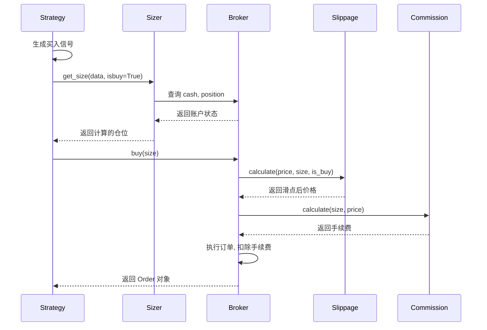
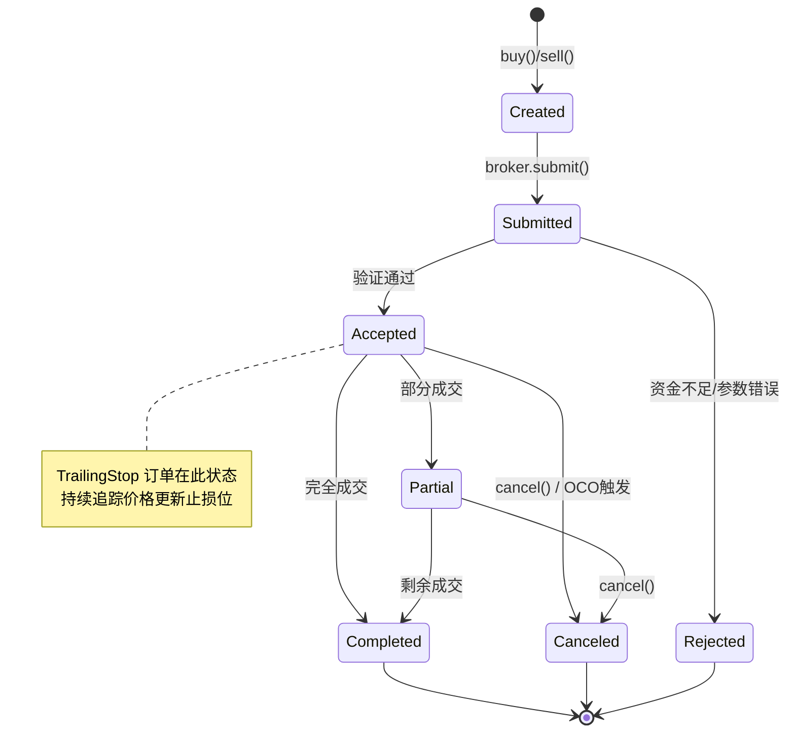
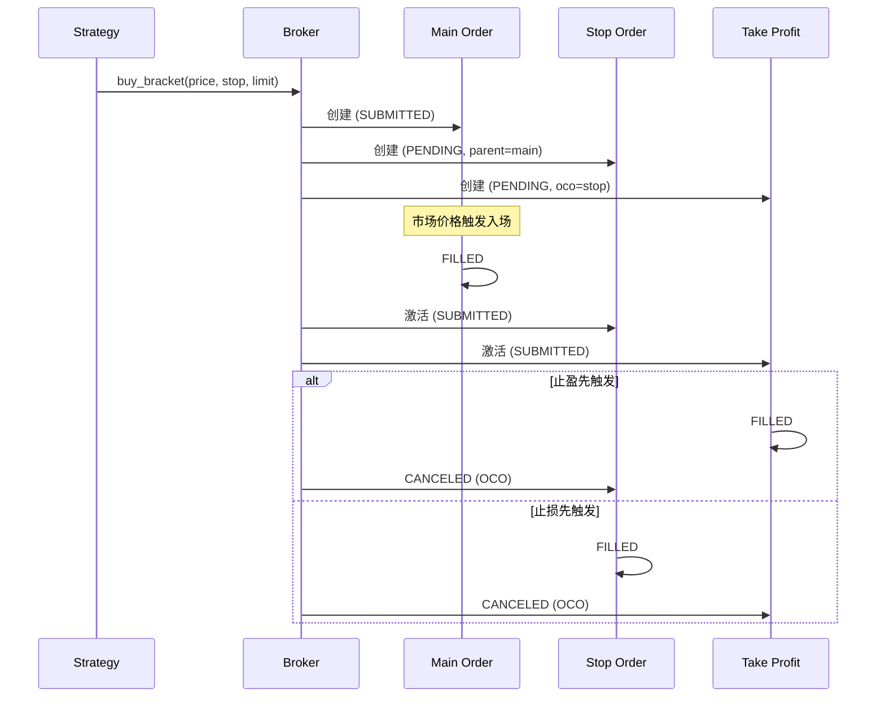

# Phase 3 - Step 3: 交易引擎强化 (ENGINE FORTIFICATION)

## 1. 概述 (Overview)
Step 3 的目标是从**资金管理**、**高级订单**和**仿真真实度**三个维度全面升级回测引擎。通过引入 Sizer 体系实现自动化仓位计算，通过移动止损和挂钩订单增强风控能力，通过滑点与手续费模型提升回测的仿真精度。

> [!NOTE]
> **设计参考**：Backtrader 的 `Sizer` 体系与 `Broker` 撮合逻辑，保持 API 兼容性的同时针对加密货币场景优化。

> [!CAUTION]
> **设计原则：不保证向后兼容 (Breaking Changes Allowed)**
> 为了实现最简洁、高性能的架构，本阶段**不考虑向后兼容**。将对 `Order` 模型新增多个字段（`parent_id`, `oco_id`, `trail_amount` 等），并扩展 `OrderType` 枚举。现有直接依赖 `Order` 序列化格式的代码可能需要适配，请放心进行破坏性修改。

---

## 2. 依赖项 (Dependencies)

本阶段**无需新增外部依赖**，所有功能基于现有技术栈实现：

| 依赖 | 用途 | 状态 |
|-----|------|------|
| `dataclasses` | Sizer/Slippage 参数类 | ✅ 标准库 |
| `abc` | 抽象基类定义 | ✅ 标准库 |
| `typing` | 类型标注 | ✅ 标准库 |

**复用 STEP2 的组件**：
- `src/data/binance_futures.py` — 用于获取合约资金费率数据
- `src/data/repository.py` — 资金费率的本地缓存

---

## 3. 核心功能明细

### 3.1 Sizer 资金管理体系 (T7) 💰

#### 3.1.1 设计理念
将 **"交易什么" (Strategy)** 与 **"交易多少" (Sizer)** 解耦：
- 策略只负责生成信号（买/卖）
- Sizer 根据账户状态、风险参数自动计算最优仓位
- 同一策略可配置不同 Sizer 适配不同资金规模

#### 3.1.2 Sizer 类型

| Sizer 类型 | 说明 | 参数 |
|-----------|------|------|
| **FixedSize** | 固定数量 | `stake`: 固定下单数量 |
| **PercentSize** | 可用资金百分比 | `percent`: 资金占比 (0-100) |
| **AllIn** | 全仓投入 | - |
| **RiskSize** | 基于 ATR 的风险仓位 | `risk_percent`: 单次风险比例, `atr_period`: ATR 周期 |

#### 3.1.3 核心接口设计

**基础抽象类 `BaseSizer`**:
```python
from abc import ABC, abstractmethod
from dataclasses import dataclass
from typing import TYPE_CHECKING

if TYPE_CHECKING:
    from src.backtest.broker import Broker

@dataclass
class SizerParams:
    """Sizer 通用参数"""
    stake: float = 1.0
    percent: float = 20.0
    risk_percent: float = 2.0
    atr_period: int = 14

class BaseSizer(ABC):
    """Sizer 基类 - 所有 Sizer 必须继承此类"""
    
    def __init__(self, params: SizerParams | None = None):
        self.params = params or SizerParams()
        self._broker: "Broker | None" = None
        self._strategy = None
    
    def set_broker(self, broker: "Broker") -> None:
        """注入 Broker 依赖"""
        self._broker = broker
    
    def set_strategy(self, strategy) -> None:
        """注入 Strategy 依赖"""
        self._strategy = strategy
    
    @abstractmethod
    def get_size(self, data, isbuy: bool) -> float:
        """
        计算下单数量（核心方法）
        
        Args:
            data: 目标数据源
            isbuy: True=买入, False=卖出
            
        Returns:
            float: 下单数量（0 表示不交易）
        """
        raise NotImplementedError
    
    @property
    def cash(self) -> float:
        """当前可用现金"""
        return self._broker.get_cash() if self._broker else 0.0
    
    @property
    def position(self):
        """当前持仓"""
        return self._broker.get_position() if self._broker else None
```

**具体实现示例 - PercentSize**:
```python
class PercentSize(BaseSizer):
    """按可用资金百分比计算仓位"""
    
    def get_size(self, data, isbuy: bool) -> float:
        if not self._broker:
            return 0.0
        
        price = data.close[0]
        available_cash = self.cash * (self.params.percent / 100.0)
        size = available_cash / price
        
        return size if isbuy else -size
```

**RiskSize (基于 ATR)**:
```python
class RiskSize(BaseSizer):
    """基于 ATR 的风险仓位管理"""
    
    def get_size(self, data, isbuy: bool) -> float:
        if not self._broker or not self._strategy:
            return 0.0
        
        # 获取 ATR 值（需策略预计算）
        atr = getattr(self._strategy, 'atr', None)
        if atr is None:
            return self.params.stake  # 回退到固定数量
        
        # 风险金额 = 账户净值 × 风险比例
        equity = self._broker.get_value()
        risk_amount = equity * (self.params.risk_percent / 100.0)
        
        # 仓位 = 风险金额 / (ATR × 倍数)
        atr_value = atr[0] if hasattr(atr, '__getitem__') else atr
        size = risk_amount / (atr_value * 2)  # 2倍 ATR 作为止损距离
        
        return size if isbuy else -size
```

#### 3.1.4 策略集成方式

```python
class MyStrategy(Strategy):
    def __init__(self):
        # 方式1: 策略内设置 Sizer
        self.setsizer(PercentSize(SizerParams(percent=30)))
        
    def next(self):
        if self.should_buy():
            # 方式2: 使用 Sizer 自动计算仓位
            self.buy()  # 自动调用 sizer.get_size()
            
            # 方式3: 手动指定数量（覆盖 Sizer）
            self.buy(size=0.5)
```

---

### 3.2 高级风控订单 (T8) 🛡️

#### 3.2.1 移动止损 (Trailing Stop)

**工作原理**：
- 止损价格随价格上涨而上移，但不会随价格下跌而下调
- 当价格回撤到止损价时触发卖出

**参数配置**：
| 参数 | 类型 | 说明 |
|------|------|------|
| `trailamount` | float | 固定金额止损距离 |
| `trailpercent` | float | 百分比止损距离 (0.05 = 5%) |

**使用示例**：
```python
def next(self):
    if not self.position:
        self.buy()
    else:
        # 固定金额移动止损
        self.sell(
            exectype=Order.StopTrail,
            trailamount=100  # 止损距离 $100
        )
        
        # 或：百分比移动止损
        self.sell(
            exectype=Order.StopTrail,
            trailpercent=0.05  # 5% 回撤止损
        )
```

**Broker 端逻辑**：
```python
def _update_trailing_stop(self, order: Order, current_price: float):
    """每 Bar 更新移动止损价格"""
    if order.is_buy:
        # 做空的止损：向下追踪
        new_stop = current_price + order.trail_distance
        order.stop_price = min(order.stop_price, new_stop)
    else:
        # 做多的止损：向上追踪
        new_stop = current_price - order.trail_distance
        order.stop_price = max(order.stop_price, new_stop)
```

#### 3.2.2 挂钩订单 (Bracket Order)

**组成**：
1. **主订单 (Main)**: 入场订单 (Limit/Market)
2. **止损订单 (Stop)**: 亏损保护
3. **止盈订单 (Limit)**: 获利了结

**特性**：
- 三单一体，主订单成交后止损/止盈单自动激活
- 止损或止盈任一触发后，自动取消另一单 (OCO)

**OCO (One-Cancels-Other) 机制详解**：
```python
def _process_oco_cancellation(self, filled_order: Order):
    """当 OCO 组中任一订单成交，取消另一订单"""
    if not filled_order.oco_id:
        return
    
    # 查找关联的 OCO 订单
    for order in self._active_orders:
        if order.id == filled_order.oco_id:
            order.status = OrderStatus.CANCELED
            order.error_msg = "OCO: 关联订单已成交"
            self._notify_order(order)
            break

def _activate_child_orders(self, parent_order: Order):
    """主订单成交后，激活子订单（止损/止盈）"""
    for order in self._pending_child_orders:
        if order.parent_id == parent_order.id:
            order.status = OrderStatus.SUBMITTED
            self._active_orders.append(order)
```

**API 设计**：
```python
def buy_bracket(
    self,
    price: float | None = None,         # 入场价格
    size: float | None = None,          # 仓位大小
    stopprice: float | None = None,     # 止损价格
    limitprice: float | None = None,    # 止盈价格
    stopargs: dict | None = None,       # 止损单额外参数
    limitargs: dict | None = None,      # 止盈单额外参数
) -> tuple[Order, Order, Order]:
    """创建买入挂钩订单组"""
    
    # 1. 创建主订单
    main_order = self.buy(price=price, size=size)
    
    # 2. 创建止损单（关联主订单）
    stop_order = self.sell(
        exectype=Order.Stop,
        price=stopprice,
        size=size,
        parent=main_order,
        **(stopargs or {})
    )
    
    # 3. 创建止盈单（与止损单 OCO）
    limit_order = self.sell(
        exectype=Order.Limit,
        price=limitprice,
        size=size,
        parent=main_order,
        oco=stop_order,
        **(limitargs or {})
    )
    
    return main_order, stop_order, limit_order
```

**使用示例**：
```python
def next(self):
    if self.signal_buy and not self.position:
        entry_price = self.data.close[0]
        stop_price = entry_price * 0.98   # 2% 止损
        limit_price = entry_price * 1.05  # 5% 止盈
        
        orders = self.buy_bracket(
            price=entry_price,
            stopprice=stop_price,
            limitprice=limit_price
        )
        self.bracket_orders = orders
```

---

### 3.3 专业仿真度提升 (T9) 📊

#### 3.3.1 滑点模型 (Slippage)

**支持的模型**：

| 模型 | 类 | 计算公式 |
|------|---|---------||
| 固定滑点 | `FixedSlippage` | `executed_price = price ± slip_amount` |
| 百分比滑点 | `PercentSlippage` | `executed_price = price × (1 ± slip_percent)` |
| 成交量滑点 | `VolumeSlippage` | 基于订单量/市场量比例动态计算 |

**实现示例**：
```python
from abc import ABC, abstractmethod
from dataclasses import dataclass

@dataclass
class SlippageParams:
    fixed_amount: float = 0.0
    percent: float = 0.0
    volume_impact: float = 0.1

class BaseSlippage(ABC):
    """滑点模型基类"""
    
    def __init__(self, params: SlippageParams | None = None):
        self.params = params or SlippageParams()
    
    @abstractmethod
    def calculate(self, price: float, size: float, is_buy: bool) -> float:
        """计算滑点后的成交价格"""
        raise NotImplementedError
    
class FixedSlippage(BaseSlippage):
    """固定金额滑点"""
    
    def calculate(self, price: float, size: float, is_buy: bool) -> float:
        slip = self.params.fixed_amount
        return price + slip if is_buy else price - slip

class PercentSlippage(BaseSlippage):
    """百分比滑点"""
    
    def calculate(self, price: float, size: float, is_buy: bool) -> float:
        slip = price * self.params.percent
        return price + slip if is_buy else price - slip
```

**Broker 配置**：
```python
# 设置固定滑点
broker.set_slippage(FixedSlippage(SlippageParams(fixed_amount=0.01)))

# 设置百分比滑点 (0.1%)
broker.set_slippage(PercentSlippage(SlippageParams(percent=0.001)))
```

#### 3.3.2 手续费模型 (Commission)

**配置项**：
| 参数 | 说明 | 默认值 |
|------|------|--------|
| `maker_fee` | Maker 费率 | 0.001 (0.1%) |
| `taker_fee` | Taker 费率 | 0.001 (0.1%) |
| `min_fee` | 最低手续费 | 0.0 |

**实现**：
```python
@dataclass
class CommissionScheme:
    """手续费配置"""
    maker_fee: float = 0.001  # 0.1%
    taker_fee: float = 0.001  # 0.1%
    min_fee: float = 0.0
    
    def calculate(self, size: float, price: float, is_maker: bool = False) -> float:
        """计算手续费"""
        trade_value = abs(size) * price
        fee_rate = self.maker_fee if is_maker else self.taker_fee
        fee = trade_value * fee_rate
        return max(fee, self.min_fee)
```

**按交易对配置**：
```python
# 设置默认手续费
broker.set_commission(CommissionScheme(taker_fee=0.001))

# 为特定交易对设置不同费率
broker.set_commission(
    CommissionScheme(taker_fee=0.0005),
    symbol="BTCUSDT"
)
```

#### 3.3.3 合约仿真 (Futures Simulation)

> [!WARNING]
> 合约仿真为 **实验性功能**，初期仅支持基本的杠杆管理和资金费结算。

**复用 STEP2 组件**：
- 资金费率数据：通过 `BinanceFuturesClient.get_funding_rate()` 获取
- 本地缓存：通过 `MarketDataRepository` 实现 Lazy Sync

**核心功能**：
- **杠杆管理**: 支持 1x-125x 杠杆设置
- **保证金计算**: `margin = position_value / leverage`
- **资金费结算**: 每 8 小时根据资金费率计算损益

```python
@dataclass
class FuturesConfig:
    leverage: int = 1
    funding_interval_hours: int = 8

class FuturesBroker(Broker):
    """合约模拟经纪商"""
    
    def __init__(self, config: FuturesConfig):
        super().__init__()
        self.config = config
        self.last_funding_time: int | None = None
    
    def get_required_margin(self, size: float, price: float) -> float:
        """计算所需保证金"""
        position_value = abs(size) * price
        return position_value / self.config.leverage
    
    def settle_funding(self, timestamp: int, funding_rate: float):
        """结算资金费"""
        if not self.position or self.position.size == 0:
            return
        
        position_value = abs(self.position.size) * self.position.price
        funding_fee = position_value * funding_rate
        
        # 多头付资金费，空头收资金费（当 rate > 0）
        if self.position.size > 0:
            self.cash -= funding_fee
        else:
            self.cash += funding_fee
```

---

## 4. 文件修改说明

### 4.1 [MODIFY] [models.py](file:///Users/lixiansheng/Downloads/PyQuantAlpha/src/backtest/models.py)

**扩展 `OrderType` 枚举**：
```diff
class OrderType(Enum):
    MARKET = "MARKET"
    LIMIT = "LIMIT"
    STOP = "STOP"
    STOP_LIMIT = "STOP_LIMIT"
+   STOP_TRAIL = "STOP_TRAIL"      # 移动止损
```

**扩展 `Order` 数据类**：
```diff
@dataclass
class Order:
    # ... 现有字段 ...
    triggered: bool = False
+   # === Phase 3.3 新增 ===
+   parent_id: str | None = None        # 父订单 ID (用于 Bracket)
+   oco_id: str | None = None           # OCO 关联订单 ID
+   trail_amount: float | None = None   # 移动止损：固定金额
+   trail_percent: float | None = None  # 移动止损：百分比
+   highest_price: float = 0.0          # 追踪期间最高价
+   lowest_price: float = float('inf')  # 追踪期间最低价
```

### 4.2 [MODIFY] [broker.py](file:///Users/lixiansheng/Downloads/PyQuantAlpha/src/backtest/broker.py)

**新增方法**：
| 方法 | 说明 |
|------|------|
| `set_sizer(sizer: BaseSizer)` | 设置默认 Sizer |
| `set_slippage(slippage: BaseSlippage)` | 设置滑点模型 |
| `set_commission(scheme: CommissionScheme, symbol: str = None)` | 设置手续费 |
| `_update_trailing_stops(bar: Bar)` | 每 Bar 更新移动止损价格 |
| `_process_oco_cancellation(order: Order)` | 处理 OCO 取消逻辑 |

**修改方法**：
| 方法 | 修改内容 |
|------|----------|
| `_try_match()` | 增加 `STOP_TRAIL` 类型处理 |
| `_execute_fill()` | 集成滑点计算与 OCO 处理 |
| `process_orders()` | 先更新追踪止损，再撮合 |

### 4.3 [MODIFY] [strategy.py](file:///Users/lixiansheng/Downloads/PyQuantAlpha/src/backtest/strategy.py)

**新增方法**：
| 方法 | 说明 |
|------|------|
| `setsizer(sizer: BaseSizer)` | 设置策略级 Sizer |
| `getsizer()` | 获取当前 Sizer |
| `buy_bracket(...)` | 创建买入挂钩订单组 |
| `sell_bracket(...)` | 创建卖出挂钩订单组 |

---

## 5. 技术架构

### 5.1 目录结构

```
src/
├── backtest/
│   ├── sizers/
│   │   ├── __init__.py       # 模块导出
│   │   ├── base.py           # BaseSizer 抽象类
│   │   ├── fixed.py          # FixedSize
│   │   ├── percent.py        # PercentSize, AllIn
│   │   └── risk.py           # RiskSize (ATR-based)
│   ├── slippage/
│   │   ├── __init__.py
│   │   ├── base.py           # BaseSlippage
│   │   ├── fixed.py          # FixedSlippage
│   │   └── percent.py        # PercentSlippage
│   ├── commission.py         # CommissionScheme
│   ├── broker.py             # [MODIFY] 集成 Sizer/Slippage/Commission
│   ├── models.py             # [MODIFY] 新增 STOP_TRAIL, 扩展 Order 字段
│   └── strategy.py           # [MODIFY] 新增 setsizer(), buy_bracket()
└── api/
    └── routes/
        └── backtest.py       # [MODIFY] 暴露配置接口
```

### 5.2 组件交互图



### 5.3 订单状态机



### 5.4 Bracket Order 生命周期



---

## 6. 优先级与计划

| 阶段 | 任务 | 依赖 | 预估工时 |
|-----|------|------|---------|
| **M1** | Sizer 基础架构 | - | 4h |
| **M2** | FixedSize, PercentSize, AllIn | M1 | 3h |
| **M3** | RiskSize (ATR-based) | M2, 指标库 | 3h |
| **M4** | TrailingStop 订单类型 | - | 4h |
| **M5** | Bracket Order 自动化 | M4 | 4h |
| **M6** | 滑点模型 (Fixed/Percent) | - | 3h |
| **M7** | 手续费模型 | - | 2h |
| **M8** | 合约仿真 (实验性) | M6, M7 | 6h |

---

## 7. 验证计划 (Verification Plan)

### 7.1 测试文件规划

| 测试文件 | 覆盖模块 | 测试内容 |
|---------|---------|---------|
| `tests/test_backtest/test_sizers.py` | `src/backtest/sizers/` | Sizer 计算逻辑 |
| `tests/test_backtest/test_slippage.py` | `src/backtest/slippage/` | 滑点模型 |
| `tests/test_backtest/test_commission.py` | `src/backtest/commission.py` | 手续费计算 |
| `tests/test_backtest/test_trailing_stop.py` | `src/backtest/broker.py` | 移动止损 |
| `tests/test_backtest/test_bracket_order.py` | `src/backtest/broker.py` | 挂钩订单 + OCO |
| `tests/test_backtest/test_futures_broker.py` | `src/backtest/futures.py` | 合约仿真 |

### 7.2 运行命令

```bash
# 激活 Conda 环境（必须先执行）
conda activate pyquantalpha

# Sizer 测试
pytest tests/test_backtest/test_sizers.py -v

# 高级订单测试
pytest tests/test_backtest/test_trailing_stop.py tests/test_backtest/test_bracket_order.py -v

# 滑点与手续费测试
pytest tests/test_backtest/test_slippage.py tests/test_backtest/test_commission.py -v

# 全部 Step 3 相关测试
pytest tests/test_backtest/test_sizers.py tests/test_backtest/test_slippage.py tests/test_backtest/test_commission.py tests/test_backtest/test_trailing_stop.py tests/test_backtest/test_bracket_order.py -v
```

### 7.3 验证标准 (Checklist)

#### Sizer 测试
- [ ] `FixedSize` 始终返回固定数量
- [ ] `PercentSize(50)` 在 $10,000 资金、$100 价格时返回 50 单位
- [ ] `AllIn` 使用全部可用资金计算仓位
- [ ] `RiskSize` 根据 ATR 动态调整仓位，2% 风险对应正确的数量
- [ ] Sizer 无 Broker 注入时返回 0

#### 高级订单测试
- [ ] `StopTrail` 止损价随价格上涨自动上移
- [ ] `StopTrail` 止损价在价格下跌时保持不变
- [ ] `StopTrail` 支持固定金额和百分比两种模式
- [ ] `BracketOrder` 主订单成交后自动激活止损/止盈单
- [ ] `BracketOrder` OCO：止损触发后自动取消止盈单
- [ ] `BracketOrder` OCO：止盈触发后自动取消止损单
- [ ] 子订单在主订单未成交时保持 PENDING 状态

#### 仿真真实度测试
- [ ] 固定滑点正确应用于成交价格
- [ ] 百分比滑点按比例计算
- [ ] 买入时滑点增加成交价，卖出时减少
- [ ] 手续费从账户正确扣除
- [ ] Maker/Taker 费率区分正确
- [ ] 合约资金费按 8 小时周期结算
- [ ] 多头在正费率时扣费，空头在正费率时收费

---

## 8. API 端点规划

| 端点 | 方法 | 说明 | 状态 |
|-----|------|------|------|
| `/api/backtest/config/sizer` | POST | 配置回测 Sizer | 🔲 待实现 |
| `/api/backtest/config/slippage` | POST | 配置滑点模型 | 🔲 待实现 |
| `/api/backtest/config/commission` | POST | 配置手续费 | 🔲 待实现 |
| `/api/backtest/config/futures` | POST | 配置合约参数 | 🔲 待实现 |

---

## 9. 完成状态 (Progress)

- [x] **M1**: Sizer 基础架构 ✅
  - [x] `BaseSizer` 抽象类
  - [x] `SizerParams` 参数类
  - [x] Broker 集成点
- [x] **M2**: 基础 Sizer 实现 ✅
  - [x] `FixedSize`
  - [x] `PercentSize`
  - [x] `AllIn`
- [x] **M3**: RiskSize (ATR-based) ✅
- [x] **M4**: TrailingStop 订单 ✅
  - [x] `Order` 模型扩展
  - [x] Broker 追踪逻辑
- [x] **M5**: Bracket Order ✅
  - [x] OCO 机制
  - [x] 父子订单关联
  - [x] `add_child_order()` API
- [x] **M6**: 滑点模型 ✅
  - [x] `BaseSlippage` 抽象类
  - [x] `FixedSlippage`
  - [x] `PercentSlippage`
  - [x] `VolumeSlippage`
- [x] **M7**: 手续费模型 ✅
  - [x] `CommissionScheme`
  - [x] `CommissionManager` (按交易对配置)
- [ ] **M8**: 合约仿真 (实验性)
  - [ ] 杠杆管理
  - [ ] 资金费结算

### 测试统计

| 测试文件 | 通过 | 说明 |
|---------|------|------|
| `test_sizers.py` | 21 | Sizer 计算逻辑 |
| `test_slippage.py` | 15 | 滑点模型 |
| `test_commission.py` | 11 | 手续费计算 |
| `test_trailing_stop.py` | 6 | 移动止损 |
| `test_bracket_order.py` | 5 | 挂钩订单 + OCO |
| **新增合计** | **58** | |
| **回测模块总计** | **154** | ✅ 全部通过 |

> **状态**: 🎉 **M1-M7 已完成** (2025-12-26)

---

## 10. AI 提示词更新 ✅

已更新 `src/ai/prompt.py` 以支持 AI 生成使用新特性的策略。

### 10.1 已新增的 API 文档

在 `SYSTEM_PROMPT` 的 **交易 API** 章节添加：

```python
## 资金管理 (Sizer)
系统支持自动仓位计算。策略可通过 `setsizer()` 配置：

- `self.setsizer("fixed", stake=0.1)`: 固定数量（每次下单 0.1）
- `self.setsizer("percent", percent=20)`: 可用资金的 20%
- `self.setsizer("risk", risk_percent=2)`: 基于 ATR 的风险仓位（单次亏损不超过 2%）

配置 Sizer 后，调用 `self.order()` 时可省略 `quantity` 参数：
```python
def init(self):
    self.setsizer("percent", percent=30)  # 每次用 30% 资金

def on_bar(self, data):
    if buy_signal:
        self.order("BTCUSDT", "BUY")  # 数量自动计算
```

## 挂钩订单 (Bracket Order)
一键创建入场 + 止损 + 止盈三联单：

- `self.buy_bracket(symbol, stopprice, limitprice, size=None)`
- `self.sell_bracket(symbol, stopprice, limitprice, size=None)`

止损/止盈任一触发后，另一单自动取消 (OCO)。

```python
def on_bar(self, data):
    if entry_signal and not self.get_position("BTCUSDT"):
        price = data.close
        self.buy_bracket(
            "BTCUSDT",
            stopprice=price * 0.98,   # 2% 止损
            limitprice=price * 1.05   # 5% 止盈
        )
```

## 移动止损 (Trailing Stop)
止损价随价格上涨自动上移：

- `self.trailing_stop(symbol, trailamount=100)`: 固定金额（价格回撤 $100 触发）
- `self.trailing_stop(symbol, trailpercent=0.05)`: 百分比（价格回撤 5% 触发）

```python
def on_bar(self, data):
    pos = self.get_position("BTCUSDT")
    if pos and pos.quantity > 0:
        self.trailing_stop("BTCUSDT", trailpercent=0.03)  # 3% 移动止损
```
```

### 10.2 新增策略示例

在提示词中添加综合示例：

```python
class Strategy:
    """综合示例：ATR 风险管理 + 挂钩订单"""
    
    def init(self):
        self.atr = ATR(14)
        self.ema_fast = EMA(20)
        self.ema_slow = EMA(60)
        # 配置基于 ATR 的风险仓位（单次风险 2%）
        self.setsizer("risk", risk_percent=2)
    
    def on_bar(self, data):
        close = data.close if hasattr(data, 'close') else data['BTCUSDT'].close
        high = data.high if hasattr(data, 'high') else data['BTCUSDT'].high
        low = data.low if hasattr(data, 'low') else data['BTCUSDT'].low
        
        # 更新指标
        atr_val = self.atr.update(high, low, close)
        fast = self.ema_fast.update(close)
        slow = self.ema_slow.update(close)
        
        if not all([atr_val, fast, slow]):
            return
        
        pos = self.get_position("BTCUSDT")
        
        # 金叉入场 + 自动挂钩订单
        if fast > slow and not pos:
            stop = close - 2 * atr_val   # 2 ATR 止损
            limit = close + 3 * atr_val  # 3 ATR 止盈
            self.buy_bracket("BTCUSDT", stopprice=stop, limitprice=limit)
```

---

## 11. 后续 (Next Steps)

- [x] **AI 提示词更新**: 已完成 Sizer/高级订单 API 文档 ✅
- [ ] **Phase 3.4**: 实现业绩评价系统 (Analyzers)
  - Sharpe Ratio, Max Drawdown, Profit Factor
  - 基准对比 (BTC Benchmark)
- [ ] **性能测试**: 验证新组件对回测速度的影响
- [ ] **前端集成**: 在回测配置 UI 中添加 Sizer/滑点/手续费配置选项

