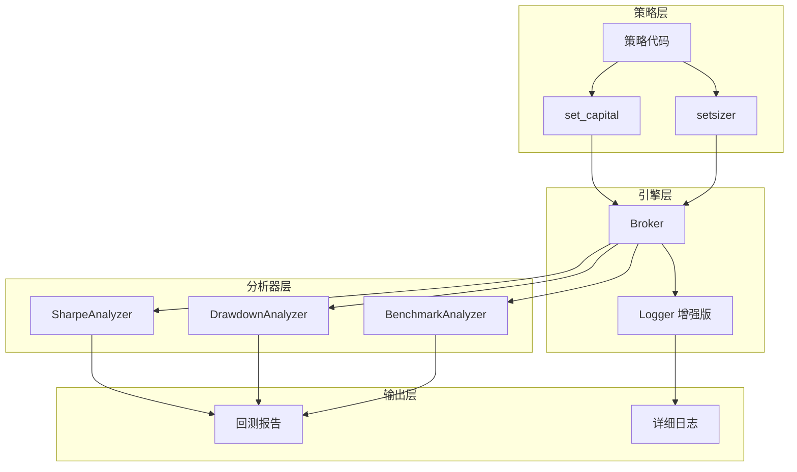

# Phase 3 - Step 4: 业绩评价与配置增强 (EVALUATION & CONFIG)

> **最后更新**: 2025-12-26
> **状态**: 📋 规划中

## 1. 概述 (Overview)

Step 4 的目标是从 **业绩评价**、**策略配置** 和 **可视化增强** 三个维度完善回测系统。通过引入专业分析器量化策略优劣，通过策略内配置实现灵活的资金管理，通过增强日志系统提升调试效率。

> [!NOTE]
> **设计参考**: Backtrader 的 `Analyzers` 评价系统，以及专业量化平台的配置模式。

---

## 2. 功能模块

### 2.1 业绩评价系统 (T10-T11) 📊

#### 2.1.1 目标
- 自动计算核心绩效指标
- 支持基准对比（vs BTC）
- 生成专业级回测报告

#### 2.1.2 核心指标

| 指标 | 英文 | 计算公式 | 说明 |
|------|------|---------|------|
| **夏普比率** | Sharpe Ratio | `(R - Rf) / σ` | 风险调整后收益 |
| **最大回撤** | Max Drawdown | `max(peak - trough) / peak` | 最大亏损幅度 |
| **卡尔玛比率** | Calmar Ratio | `年化收益 / 最大回撤` | 收益回撤比 |
| **胜率** | Win Rate | `盈利次数 / 总次数` | 盈利交易占比 |
| **盈亏比** | Profit Factor | `总盈利 / 总亏损` | 盈利能力 |
| **收益波动率** | Volatility | `std(daily_returns) * √252` | 年化波动率 |
| **索提诺比率** | Sortino Ratio | `(R - Rf) / σd` | 仅考虑下行风险 |

#### 2.1.3 基准对比 (Benchmark)

```python
# 使用方式
result = engine.run(strategy_code, bars, benchmark="BTCUSDT")

# 返回结果包含
result.benchmark_return     # 基准收益率
result.alpha                # 超额收益
result.beta                 # 市场敏感度
result.information_ratio    # 信息比率
```

#### 2.1.4 实现计划

##### [NEW] `src/backtest/analyzers/__init__.py`
```python
from .base import BaseAnalyzer
from .sharpe import SharpeRatioAnalyzer
from .drawdown import DrawdownAnalyzer
from .returns import ReturnsAnalyzer
from .benchmark import BenchmarkAnalyzer
```

##### [MODIFY] `src/backtest/analyzer.py`
- 重构为调用 `analyzers/` 子模块
- 支持自定义 Analyzer 扩展

##### 文件清单

| 文件 | 类型 | 说明 |
|------|------|------|
| `src/backtest/analyzers/__init__.py` | NEW | 分析器模块入口 |
| `src/backtest/analyzers/base.py` | NEW | BaseAnalyzer 抽象类 |
| `src/backtest/analyzers/sharpe.py` | NEW | Sharpe/Sortino 计算 |
| `src/backtest/analyzers/drawdown.py` | NEW | 回撤分析 |
| `src/backtest/analyzers/returns.py` | NEW | 收益分析 |
| `src/backtest/analyzers/benchmark.py` | NEW | 基准对比 |
| `tests/test_backtest/test_analyzers.py` | NEW | 分析器测试 |

---

### 2.2 策略内资金配置 (T12) 💰

#### 2.2.1 目标
- 策略代码中可配置初始资金
- 无需前端 UI 输入
- 如未配置则使用默认值

#### 2.2.2 API 设计

```python
class Strategy:
    def init(self):
        # 设置初始资金（可选，默认 100,000）
        self.set_capital(50000)
        
        # 设置仓位管理
        self.setsizer("risk", risk_percent=2)
```

#### 2.2.3 实现计划

##### [MODIFY] `src/backtest/engine.py`
```python
def _load_strategy(self, strategy_code: str) -> None:
    # ... 现有代码 ...
    
    # 新增：资金配置 API
    self._strategy.set_capital = self._api_set_capital

def _api_set_capital(self, amount: float) -> None:
    """设置初始资金（必须在 init() 中调用）"""
    if amount <= 0:
        raise ValueError("初始资金必须大于 0")
    
    self.config.initial_capital = amount
    self._broker.cash = amount
    self._broker._initial_capital = amount
```

##### [MODIFY] `src/ai/prompt.py`
添加 `set_capital()` API 文档：
```
## 资金配置 API（可选）
self.set_capital(50000)  # 设置初始资金为 $50,000，默认 $100,000
```

---

### 2.3 日志系统增强 (T13) 📝

#### 2.3.1 目标
- 记录 Bracket Order 父子关系
- 记录 OCO 取消事件
- 记录 Trailing Stop 追踪状态
- 支持导出详细订单流水

#### 2.3.2 增强内容

| 日志类型 | 当前状态 | 增强后 |
|---------|---------|--------|
| 订单创建 | ✅ 基本信息 | + parent_id, oco_id |
| 订单取消 | ⚠️ 简单记录 | + OCO 关联取消说明 |
| 移动止损 | ❌ 无 | + 追踪价格, 触发价格 |
| 子订单激活 | ❌ 无 | + 父订单成交后激活日志 |

#### 2.3.3 实现计划

##### [MODIFY] `src/backtest/logger.py`

```python
def add_order(self, order: Order) -> None:
    """添加订单记录 - 增强版"""
    if not self.enabled or not self._current_entry:
        return
    
    order_info = {
        "id": order.id,
        "symbol": order.symbol,
        "side": order.side.value,
        "order_type": order.order_type.value,
        "quantity": order.quantity,
        "price": order.price,
        "trigger_price": getattr(order, 'trigger_price', None),
        "status": order.status.value,
        # 新增字段
        "parent_id": getattr(order, 'parent_id', None),
        "oco_id": getattr(order, 'oco_id', None),
        "trail_amount": getattr(order, 'trail_amount', None),
        "trail_percent": getattr(order, 'trail_percent', None),
    }
    self._current_entry.orders.append(order_info)

def log_oco_cancel(self, order_id: str, trigger_order_id: str) -> None:
    """记录 OCO 取消事件"""
    self.order_logs.append({
        "time": self._get_time_str(),
        "level": "OCO_CANCEL",
        "msg": f"订单 {order_id} 被取消（关联订单 {trigger_order_id} 已成交）"
    })

def log_bracket_activation(self, parent_id: str, child_ids: list) -> None:
    """记录挂钩订单子订单激活"""
    self.order_logs.append({
        "time": self._get_time_str(),
        "level": "BRACKET",
        "msg": f"父订单 {parent_id} 成交，激活子订单: {', '.join(child_ids)}"
    })
```

---

### 2.4 可视化增强 (T14-T15) 🎨

#### 2.4.1 目标
- 前端支持配置手续费和滑点
- 前端可选输入初始资金
- 回测结果展示增强

#### 2.4.2 实现计划

##### [MODIFY] `web/index.html`
```html
<!-- 回测配置面板 -->
<div class="config-panel">
    <div class="config-row">
        <label>初始资金</label>
        <input type="number" id="initial-capital" value="100000" placeholder="可选">
    </div>
    <div class="config-row">
        <label>手续费率</label>
        <input type="number" id="commission-rate" value="0.001" step="0.0001">
    </div>
    <div class="config-row">
        <label>滑点</label>
        <input type="number" id="slippage" value="0.0005" step="0.0001">
    </div>
</div>
```

##### [MODIFY] `web/js/api.js`
```javascript
async function runBacktest(code, symbol, interval, days) {
    const initialCapital = document.getElementById('initial-capital').value || 100000;
    const commissionRate = document.getElementById('commission-rate').value || 0.001;
    const slippage = document.getElementById('slippage').value || 0.0005;
    
    const response = await fetch('/api/backtest/run', {
        method: 'POST',
        body: JSON.stringify({
            code, symbol, interval, days,
            initial_capital: parseFloat(initialCapital),
            commission_rate: parseFloat(commissionRate),
            slippage: parseFloat(slippage)
        })
    });
    return response.json();
}
```

##### [MODIFY] `src/api/main.py`
```python
@app.post("/api/backtest/run")
async def run_backtest(request: BacktestRequest):
    config = BacktestConfig(
        initial_capital=request.initial_capital or 100000.0,
        commission_rate=request.commission_rate or 0.001,
        slippage=request.slippage or 0.0005
    )
    # ...
```

---

## 3. 里程碑 (Milestones)

| 里程碑 | 内容 | 测试覆盖 | 状态 |
|--------|------|---------|------|
| **M1** | Analyzers 架构搭建 | 单元测试 | 📋 |
| **M2** | 核心指标实现 (Sharpe, DD, Calmar) | 边界测试 | 📋 |
| **M3** | 基准对比功能 | 集成测试 | 📋 |
| **M4** | set_capital API | 单元测试 | 📋 |
| **M5** | 日志系统增强 | 单元测试 | 📋 |
| **M6** | 前端配置面板 | 手动测试 | 📋 |
| **M7** | AI 提示词更新 | E2E 测试 | 📋 |

---

## 4. 验证计划 (Verification)

### 4.1 自动化测试

```bash
# 运行分析器测试
conda activate pyquantalpha
pytest tests/test_backtest/test_analyzers.py -v

# 运行资金配置测试
pytest tests/test_backtest/test_engine_api.py -v -k "capital"

# 运行日志系统测试
pytest tests/test_backtest/test_logger.py -v
```

### 4.2 端到端测试

```bash
# 运行完整端到端测试
python tests/manual/test_e2e_complex_strategy.py
```

### 4.3 手动验证

1. **分析器验证**: 检查回测结果中的 Sharpe Ratio 计算是否正确
2. **资金配置验证**: 策略中调用 `set_capital(50000)`，检查回测是否使用 5 万初始资金
3. **前端验证**: 修改配置面板参数，检查回测结果是否反映变化

---

## 5. 预估工作量

| 模块 | 新增代码 | 修改代码 | 预估时间 |
|------|---------|---------|---------|
| 分析器架构 | ~400 lines | ~50 lines | 2 小时 |
| 基准对比 | ~150 lines | ~30 lines | 1 小时 |
| set_capital API | ~30 lines | ~20 lines | 30 分钟 |
| 日志增强 | ~80 lines | ~40 lines | 1 小时 |
| 前端配置 | ~50 lines | ~30 lines | 1 小时 |
| AI 提示词 | - | ~20 lines | 15 分钟 |
| 测试用例 | ~300 lines | - | 1.5 小时 |
| **合计** | **~1010 lines** | **~190 lines** | **~7 小时** |

---

## 6. 技术架构图



---

## 7. 设计决策（已确认）

> [!NOTE]
> 以下决策已于 2025-12-26 确认：

### D1: 基准数据获取
> **决策**: 与策略数据共享数据源
> 
> - 基准数据在回测启动时一次性获取（复用 BinanceClient）
> - 时间范围与策略数据对齐
> - 缓存到内存，无需入库

### D2: Analyzer 扩展性
> **决策**: 暂不支持自定义 Analyzer，保持简单
> 
> - 仅提供内置分析器：Sharpe, Max DD, Calmar, Win Rate, Profit Factor
> - 如未来有需求再扩展

### D3: 前端 UI 样式
> **决策**: 简洁实用，配置项隐藏在"高级选项"折叠区
> 
> - 默认值已足够（初始资金 100,000, 手续费 0.1%, 滑点 0.05%）
> - 99% 用户无需修改，保持主界面简洁
