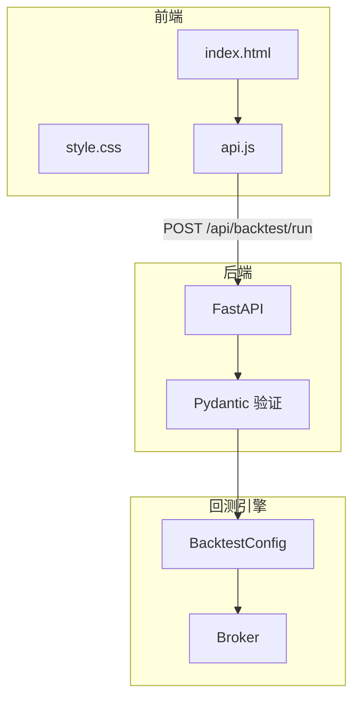

# Phase 3 - Step 5: 可视化与前端增强 (VISUALIZATION ENHANCEMENT)

> **最后更新**: 2025-12-27
> **状态**: ✅ 已完成

## 1. 概述 (Overview)

Step 5 的目标是增强前端用户体验，通过配置面板让用户可以自定义回测参数（初始资金、手续费、滑点），并提升回测结果的可视化展示。

> [!NOTE]
> **设计原则**: 保持主界面简洁，高级配置项默认隐藏，99% 用户使用默认值即可。

---

## 2. 功能模块

### 2.1 回测配置面板 (T14-T15) ⚙️

#### 2.1.1 目标
- 前端可配置初始资金
- 前端可配置手续费率
- 前端可配置滑点参数
- 配置项默认隐藏于"高级选项"折叠区

#### 2.1.2 UI 设计

```html
<!-- web/index.html -->
<details class="advanced-options">
    <summary>⚙️ 高级选项</summary>
    <div class="config-panel">
        <div class="config-row">
            <label>初始资金 ($)</label>
            <input type="number" id="initial-capital" value="100000" min="1000">
        </div>
        <div class="config-row">
            <label>手续费率 (%)</label>
            <input type="number" id="commission-rate" value="0.1" step="0.01" min="0">
        </div>
        <div class="config-row">
            <label>滑点 (%)</label>
            <input type="number" id="slippage" value="0.05" step="0.01" min="0">
        </div>
    </div>
</details>
```

#### 2.1.3 默认值

| 参数 | 默认值 | 说明 |
|------|--------|------|
| 初始资金 | $100,000 | 策略内 `set_capital()` 可覆盖 |
| 手续费率 | 0.1% | Taker 费率 |
| 滑点 | 0.05% | 百分比滑点 |

---

### 2.2 前端 API 集成 (T14)

#### 2.2.1 JavaScript 修改

```javascript
// web/js/api.js
async function runBacktest(code, symbol, interval, days) {
    // 读取高级配置
    const initialCapital = parseFloat(document.getElementById('initial-capital')?.value) || 100000;
    const commissionRate = parseFloat(document.getElementById('commission-rate')?.value) / 100 || 0.001;
    const slippage = parseFloat(document.getElementById('slippage')?.value) / 100 || 0.0005;
    
    const response = await fetch('/api/backtest/run', {
        method: 'POST',
        headers: { 'Content-Type': 'application/json' },
        body: JSON.stringify({
            code, symbol, interval, days,
            initial_capital: initialCapital,
            commission_rate: commissionRate,
            slippage: slippage
        })
    });
    return response.json();
}
```

---

### 2.3 后端 API 扩展 (T15)

#### 2.3.1 API 参数增强

```python
# src/api/main.py
from pydantic import BaseModel, Field

class BacktestRequest(BaseModel):
    code: str
    symbol: str = "BTCUSDT"
    interval: str = "1h"
    days: int = 30
    # 新增配置参数
    initial_capital: float = Field(default=100000.0, ge=1000, le=1e12)
    commission_rate: float = Field(default=0.001, ge=0, le=0.1)
    slippage: float = Field(default=0.0005, ge=0, le=0.1)

@app.post("/api/backtest/run")
async def run_backtest(request: BacktestRequest):
    config = BacktestConfig(
        initial_capital=request.initial_capital,
        commission_rate=request.commission_rate,
        slippage=request.slippage
    )
    # ... 执行回测 ...
```

---

## 3. 实现计划

### 3.1 文件清单

| 文件 | 类型 | 说明 |
|------|------|------|
| `web/index.html` | MODIFY | 添加高级选项折叠区 |
| `web/css/style.css` | MODIFY | 配置面板样式 |
| `web/js/api.js` | MODIFY | 读取配置并传递 |
| `src/api/main.py` | MODIFY | 接收新参数 |
| `src/api/schemas.py` | NEW | Pydantic 模型定义 |

### 3.2 里程碑

| 里程碑 | 内容 | 状态 |
|--------|------|------|
| **M1** | HTML 配置面板 | 📋 |
| **M2** | CSS 样式美化 | 📋 |
| **M3** | JS API 集成 | 📋 |
| **M4** | 后端参数接收 | 📋 |
| **M5** | 端到端测试 | 📋 |

---

## 4. 验证计划

### 4.1 手动测试

1. 打开前端页面
2. 展开"高级选项"
3. 修改初始资金为 50000
4. 运行回测
5. 验证回测结果使用修改后的初始资金

### 4.2 参数验证

| 场景 | 预期 |
|------|------|
| 初始资金 < 1000 | 显示错误提示 |
| 手续费率 > 10% | 显示警告或阻止 |
| 滑点为负数 | HTML min=0 阻止输入 |

---

## 5. 技术架构图



---

## 6. 预估工作量

| 模块 | 新增代码 | 修改代码 | 预估时间 |
|------|---------|---------|---------| 
| HTML 配置面板 | ~30 lines | - | 30 分钟 |
| CSS 样式 | ~50 lines | - | 30 分钟 |
| JS API 修改 | ~20 lines | ~10 lines | 30 分钟 |
| 后端参数 | ~30 lines | ~20 lines | 30 分钟 |
| 测试验证 | - | - | 30 分钟 |
| **合计** | **~130 lines** | **~30 lines** | **~2.5 小时** |
