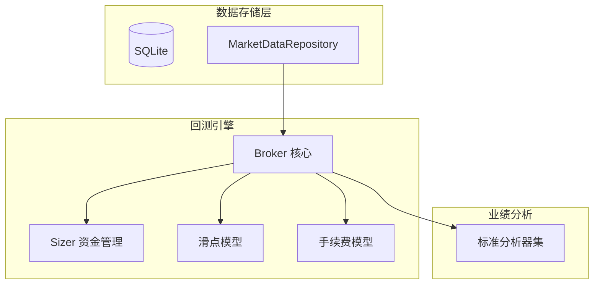

# Phase 3 开发总结报告：数据持久化与交易引擎强化

## 1. 项目背景与目标
Phase 3 的核心目标是构建稳健的本地数据持久化层，并大幅增强回测引擎的资金管理、风控订单和仿真精度。本阶段解决了 Phase 2 遗留的数据重复下载、固定仓位限制和仿真精度不足等问题，使 PyQuantAlpha 具备真正的专业级量化回测能力。

## 2. 核心成果 (Key Achievements)

### 2.1 数据库集成与持久化 (`src.database`, `src.data.repository`)
- **ORM 数据模型**: 基于 SQLAlchemy 2.0 设计了 `Candlestick`、`FundingRate`、`MarketSentiment` 等专业级 ORM 模型。
- **透明同步机制**: `MarketDataRepository` 实现 Lazy Sync，优先读取本地缓存，自动检测并补全缺失数据。
- **高性能配置**: SQLite WAL 模式，支持并发读写，单次最大批量插入 1000 条。

### 2.2 衍生品数据与指标扩张 (`src.data.binance_futures`, `src.indicators`)
- **合约数据支持**: 集成 Binance Futures API，获取资金费率 (`Funding Rate`)、多空比 (`Long/Short Ratio`)。
- **指标库深度扩张**: 新增 ADX、Ichimoku、Stochastic、CCI、OBV、Williams %R 等专业指标。
- **多周期数据同步**: 实现 `Resampler` 和 `TimeframeAlignedFeed`，杜绝未来函数风险。

### 2.3 交易引擎强化 (`src.backtest.sizers`, `src.backtest.broker`)
- **Sizer 资金管理体系**: 实现 `FixedSize`、`PercentSize`、`AllIn`、`RiskSize` 四种仓位策略，解耦"交易什么"与"交易多少"。
- **高级风控订单**: 支持 `Trailing Stop` (移动止损)、`Bracket Order` (挂钩订单)、`OCO` (一取消另一) 订单类型。
- **专业仿真模型**: 集成滑点模型 (`SlippageModel`) 和手续费模型 (`CommissionModel`)，提升回测真实度。

### 2.4 业绩评价与用户配置
- **分析器集成**: 内置 Sharpe、Sortino、Calmar、最大回撤 (`Max Drawdown`)、收益率、交易次数等标准指标。
- **策略内资金配置**: 实现 `self.set_capital()` API，允许策略在 `init()` 中动态设置初始资金。

## 3. 技术架构 (Architecture Evolution)

Phase 3 确立了完整的三层存储与计算分离架构：

- **Storage Layer**: SQLite + SQLAlchemy，支持 K 线、资金费率、市场情绪数据持久化。
- **Repository Layer**: 透明同步层，统一数据访问入口，屏蔽本地/远程复杂性。
- **Engine Layer**: Broker + Sizer + Slippage + Commission，模块化的交易仿真核心。
- **Analyzer Layer**: 独立的业绩分析与指标计算体系。

## 4. 新增 API 清单

| API | 模块 | 说明 |
|-----|------|------|
| `self.setsizer(type, **params)` | Engine | 设置仓位计算策略 |
| `self.buy_bracket(symbol, size, stopprice, limitprice)` | Engine | 买入挂钩订单 |
| `self.sell_bracket(symbol, size, stopprice, limitprice)` | Engine | 卖出挂钩订单 |
| `self.trailing_stop(symbol, size, trailpercent)` | Engine | 移动止损订单 |
| `self.set_capital(amount)` | Engine | 动态设置初始资金 |
| `self.get_funding_rates(symbol, days)` | Engine | 获取资金费率历史 |
| `self.get_sentiment(symbol, days)` | Engine | 获取市场情绪数据 |

## 5. 局限性与 Phase 4 方向

| 局限点 | 描述 | 未来计划 |
|--------|------|----------|
| **UI 配置缺失** | 手续费、滑点、初始资金需代码配置 | 前端配置面板 |
| **杠杆支持** | 尚未支持杠杆交易与保证金计算 | 合约回测模式 |
| **外部数据源** | 仅支持 Binance | 集成更多交易所 |

---

## 6. 项目规模与质量 (Metrics)

截至 Phase 3 结束，项目代码库统计数据如下：

- **代码总量**: **约 17,849 行**
    - 核心功能代码 (`src/`): ~9,192 行
    - 单元测试代码 (`tests/`): ~8,657 行
- **测试覆盖**:
    - 测试用例总数: **478 个**
    - 通过率: **100% (474 passed, 4 skipped)**
- **核心模块规模**:
    - 回测引擎 (`engine.py`): 735 行
    - 交易经纪商 (`broker.py`): 655 行
    - 数据仓库 (`repository.py`): 506 行
